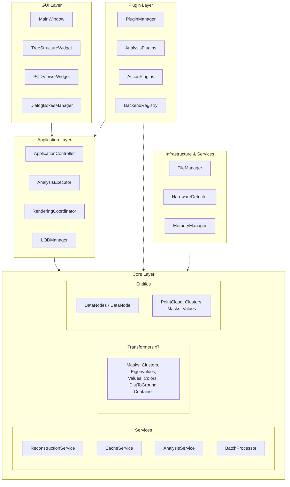
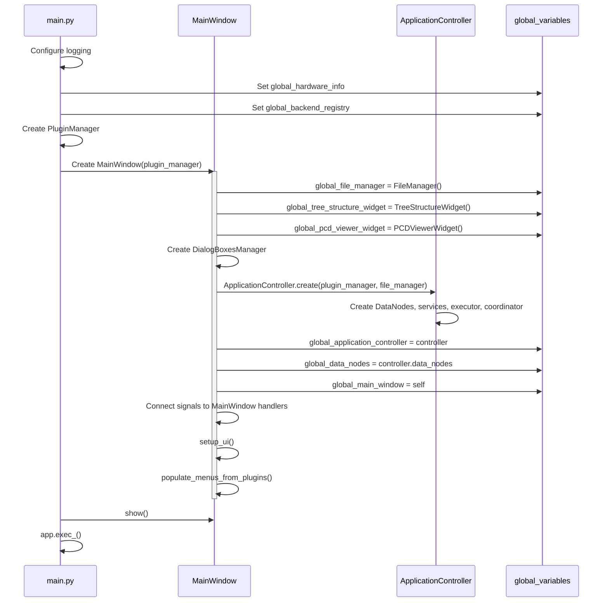
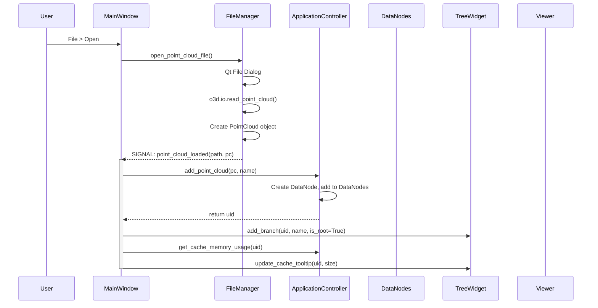
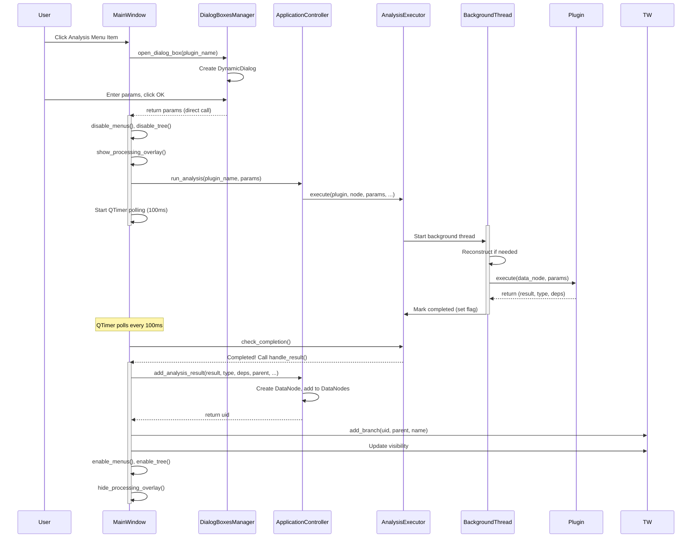
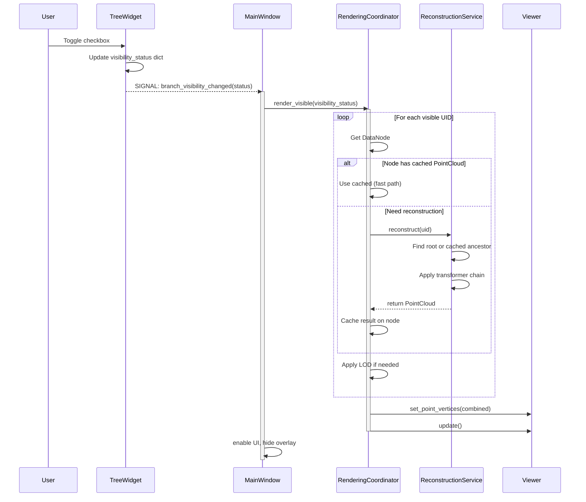
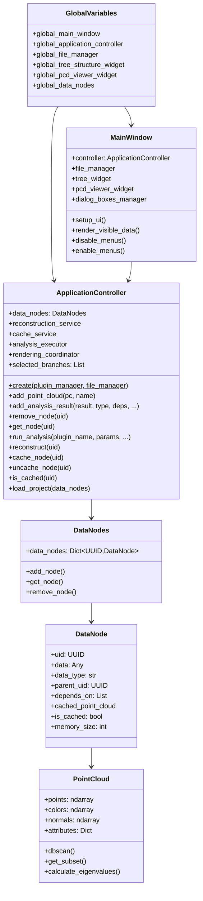
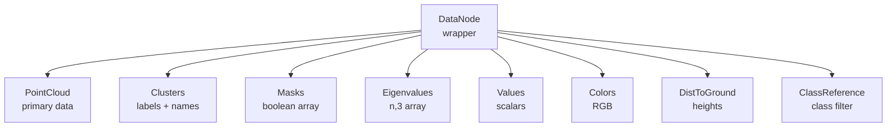
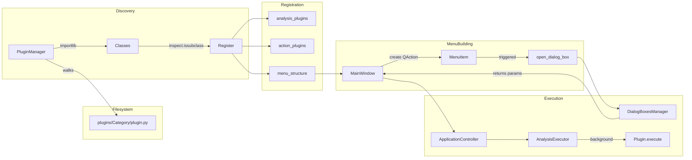

# SPCToolkit Architecture

This document describes the core framework architecture of SPCToolkit. It covers the main components, their relationships, and data flows.

> **Note:** Diagrams use [Mermaid](https://mermaid.js.org/) syntax. View in GitHub, VS Code with Mermaid extension, or [mermaid.live](https://mermaid.live).

---

## Table of Contents

1. [High-Level Overview](#1-high-level-overview)
2. [Initialization Sequence](#2-initialization-sequence)
3. [Data Flow: Loading a Point Cloud](#3-data-flow-loading-a-point-cloud)
4. [Data Flow: Running an Analysis](#4-data-flow-running-an-analysis)
5. [Data Flow: Visibility & Reconstruction](#5-data-flow-visibility--reconstruction)
6. [Component Relationships](#6-component-relationships)
7. [Plugin Integration](#7-plugin-integration)
8. [Quick Reference](#8-quick-reference)

---

## 1. High-Level Overview

The system is organized into layers: GUI, Application, Core, Infrastructure, and Plugins.



> **Singleton access:** `global_variables` (config/config.py) provides global access to MainWindow, ApplicationController, TreeStructureWidget, PCDViewerWidget, FileManager, and DataNodes. Detailed component interactions are shown in the sequence diagrams below.

### Layer Responsibilities

| Layer | Purpose | Key Files |
|-------|---------|-----------|
| **GUI** | User interaction, visualization | `gui/main_window.py`, `gui/widgets/*` |
| **Application** | Orchestration, coordination | `application/application_controller.py`, `application/analysis_executor.py`, `application/rendering_coordinator.py` |
| **Core Entities** | Data structures | `core/entities/point_cloud.py`, `core/entities/clusters.py`, `core/entities/masks.py`, `core/entities/data_node.py` |
| **Core Services** | Reconstruction, caching, analysis | `core/services/reconstruction_service.py`, `core/services/cache_service.py`, `core/services/analysis_service.py` |
| **Infrastructure** | Hardware detection, memory management | `infrastructure/hardware_detector.py`, `infrastructure/memory_manager.py` |
| **Services** | File I/O | `services/file_manager.py` |
| **Plugins** | Extensible functionality, backends | `plugins/*/`, `plugins/backends/`, `plugins/plugin_manager.py` |

### Layer Dependencies (Clean Architecture)

- **GUI** → Application → Core (inward only)
- **Infrastructure** → Core
- **Plugins** → Application + Core (via `global_variables`)
- **Core** → NOTHING (no outward dependencies)

---

## 2. Initialization Sequence

The application initializes components in a specific order to ensure dependencies are ready.



### Global Variables Assignment Locations

| Variable | Assigned In |
|----------|-------------|
| `global_file_manager` | `gui/main_window.py` |
| `global_tree_structure_widget` | `gui/main_window.py` |
| `global_pcd_viewer_widget` | `gui/main_window.py` |
| `global_application_controller` | `gui/main_window.py` |
| `global_data_nodes` | `gui/main_window.py` (from controller) |
| `global_main_window` | `gui/main_window.py` |
| `global_hardware_info` | `main.py` |
| `global_backend_registry` | `main.py` |

---

## 3. Data Flow: Loading a Point Cloud

When a user opens a file, the data flows through FileManager to MainWindow, which delegates to ApplicationController.



### Key Points

- **FileManager** handles file dialogs and Open3D I/O
- **ApplicationController** creates DataNodes and manages the data collection
- **DataNodes** is the collection manager (UUID -> DataNode mapping)
- **TreeWidget** displays the hierarchical structure

---

## 4. Data Flow: Running an Analysis

Analysis plugins run in a background thread to keep the UI responsive.



### Threading Model

- **Thread Type:** Python `threading.Thread` (NOT QThread)
- **Communication:** Flag polling via QTimer (100ms) + callbacks for progress/completion/error
- **Thread Safety:** Plugins only READ data, return NEW objects
- **No Deep Copy:** Memory efficient - relies on read-only access

---

## 5. Data Flow: Visibility & Reconstruction

When a user toggles visibility, derived data (masks, clusters) must be reconstructed to PointCloud for rendering.



### Reconstruction Process

1. **Check Cache:** If node has `cached_point_cloud`, use it immediately
2. **Find Ancestor:** Walk up tree looking for cached ancestor or root PointCloud
3. **Apply Transformers:** Use `ReconstructionService.transformer_registry` to apply transformations
4. **Cache Result:** Store reconstructed PointCloud on node for future use

### Transformer Registry

| Data Type | Transformer Class | Transformation |
|-----------|-------------------|----------------|
| `masks` | MasksTransformer | Filter points by boolean mask |
| `cluster_labels` | ClustersTransformer | Apply cluster/semantic colors |
| `eigenvalues` | EigenvaluesTransformer | Color by eigenvalue features |
| `values` | ValuesTransformer | Color by scalar values |
| `colors` | ColorsTransformer | Apply RGB colors |
| `dist_to_ground` | DistToGroundTransformer | Color by height above ground |

> **Note:** `ContainerTransformer` also exists in `core/transformers/` as a pass-through for organizational nodes but is not registered in the default `transformer_registry`.

---

## 6. Component Relationships

Static class diagram showing the main components and their relationships.



### Data Type Hierarchy



---

## 7. Plugin Integration

Plugins are discovered automatically from the folder structure and registered in menus.



### Plugin Types

| Type | Base Class | Execution | Returns |
|------|------------|-----------|---------|
| **AnalysisPlugin** | `AnalysisPlugin` | Background thread | `(result, type, deps)` |
| **ActionPlugin** | `ActionPlugin` | Main thread | `None` |

### Folder Structure = Menu Hierarchy

```
plugins/
├── 000_File/                        -> Menu: "File"
│   ├── 000_import_plugin.py         ->   "Import Point Cloud"
│   └── 010_save_plugin.py           ->   "Save Project"
├── 010_View/                        -> Menu: "View"
│   └── 000_zoom_to_extent_plugin.py ->   "Zoom To Extent"
└── 020_Points/                      -> Menu: "Points"
    └── 010_Clustering/              ->   Submenu: "Clustering"
        └── 000_dbscan_plugin.py     ->     "DBSCAN"
```

Numbering (000_, 010_, etc.) controls menu order. Folder depth controls menu nesting.

### Plugin Interfaces

```python
# Analysis Plugin (processes data, returns results)
class AnalysisPlugin(ABC):
    def get_name(self) -> str: ...
    def get_parameters(self) -> Dict[str, Any]: ...
    def execute(self, data_node, params) -> Tuple[result, type, deps]: ...

# Action Plugin (performs actions, no return)
class ActionPlugin(ABC):
    def get_name(self) -> str: ...
    def get_parameters(self) -> Dict[str, Any]: ...  # Can return {}
    def execute(self, main_window, params) -> None: ...
```

---

## 8. Quick Reference

### "I want to do X -> Look in Y"

| Task | Location |
|------|----------|
| Load a point cloud | `FileManager.open_point_cloud_file()` |
| Run an analysis plugin | `ApplicationController.run_analysis()` → `AnalysisExecutor.execute()` |
| Add a node to the tree | `MainWindow._on_point_cloud_loaded()` or `_handle_analysis_result()` |
| Render points in viewer | `PCDViewerWidget.set_point_vertices()` |
| Create a new analysis plugin | `plugins/YourCategory/your_plugin.py` (inherit `AnalysisPlugin`) |
| Create a new action plugin | `plugins/YourCategory/your_plugin.py` (inherit `ActionPlugin`) |
| Access any global manager | `from config.config import global_variables` |
| Reconstruct a branch | `ApplicationController.reconstruct(uid)` |
| Get selected tree items | `ApplicationController.selected_branches` |
| Re-render visible data | `MainWindow.render_visible_data(zoom_extent=False)` |
| Disable UI during processing | `MainWindow.disable_menus()`, `disable_tree()` |

### Signal Connections

| Signal | Source | Handler | Purpose |
|--------|--------|---------|---------|
| `point_cloud_loaded` | FileManager | MainWindow._on_point_cloud_loaded | File loaded |
| `branch_visibility_changed` | TreeStructureWidget | MainWindow._on_branch_visibility_changed | Checkbox toggled |
| `branch_selection_changed` | TreeStructureWidget | MainWindow._on_branch_selection_changed | Tree selection |
| `branch_added` | TreeStructureWidget | MainWindow._on_branch_added | New branch added |

> **Note:** Analysis parameters are passed via direct method call (`DialogBoxesManager.get_analysis_params()`), not via signal/slot.

### Key Files

| File | Purpose |
|------|---------|
| `main.py` | Application entry point |
| `gui/main_window.py` | Main window, menu building, signal handling |
| `application/application_controller.py` | Central orchestrator (factory, reconstruct, selection) |
| `application/analysis_executor.py` | Background thread analysis execution |
| `application/rendering_coordinator.py` | Visibility rendering, LOD management |
| `core/entities/data_node.py` | Single data unit wrapper |
| `core/entities/data_nodes.py` | Collection manager |
| `core/entities/point_cloud.py` | Primary data structure |
| `core/services/reconstruction_service.py` | Rebuilds PointCloud from derived data |
| `core/services/cache_service.py` | Cache management for reconstructed data |
| `core/services/analysis_service.py` | Plugin execution service |
| `core/transformers/*.py` | Data type transformers for reconstruction |
| `core/services/batch_processor.py` | Spatial batch processing for large point clouds |
| `services/file_manager.py` | File I/O operations |
| `infrastructure/hardware_detector.py` | Hardware detection (GPU, memory) |
| `infrastructure/memory_manager.py` | Memory management |
| `plugins/plugin_manager.py` | Plugin discovery and registration |
| `plugins/backends/backend_registry.py` | Backend selection (GPU/CPU) |
| `plugins/interfaces.py` | Plugin base classes |
| `config/config.py` | GlobalVariables singleton |

---

## Architectural Principles

1. **Singleton Pattern:** Use `global_variables` for inter-component communication (avoid custom signals)
2. **Background Threading:** Long operations run in threads with QTimer polling
3. **Plugin Extensibility:** Folder structure defines menu hierarchy
4. **Caching:** Reconstructed PointClouds are cached on DataNodes
5. **Read-Only Threading:** Plugins only read data, return new objects

---

## Communication Pattern

```
PREFERRED: Singleton Pattern
─────────────────────────────
global_variables.global_application_controller.reconstruct(uid)
global_variables.global_pcd_viewer_widget.update()
global_variables.global_main_window.render_visible_data()

ACCEPTABLE: Callbacks (when singleton doesn't fit)
──────────────────────────────────────────────────
component_a.process(on_complete=callback_function)

AVOID: Custom Qt Signals/Slots
──────────────────────────────
class MyClass(QObject):
    custom_signal = pyqtSignal()  # Don't do this
```

---

*Last updated: February 2026*
