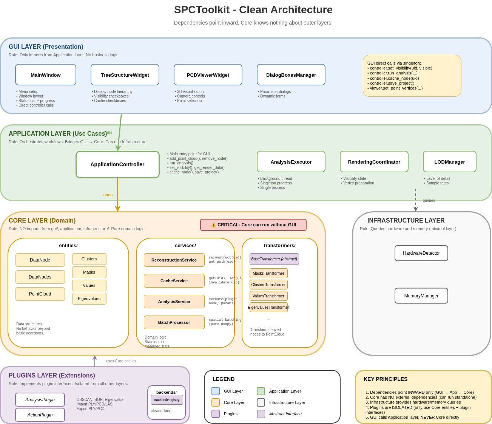
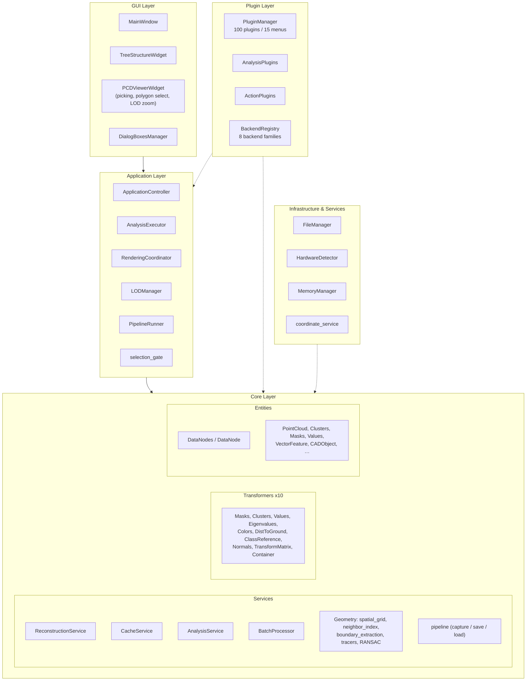
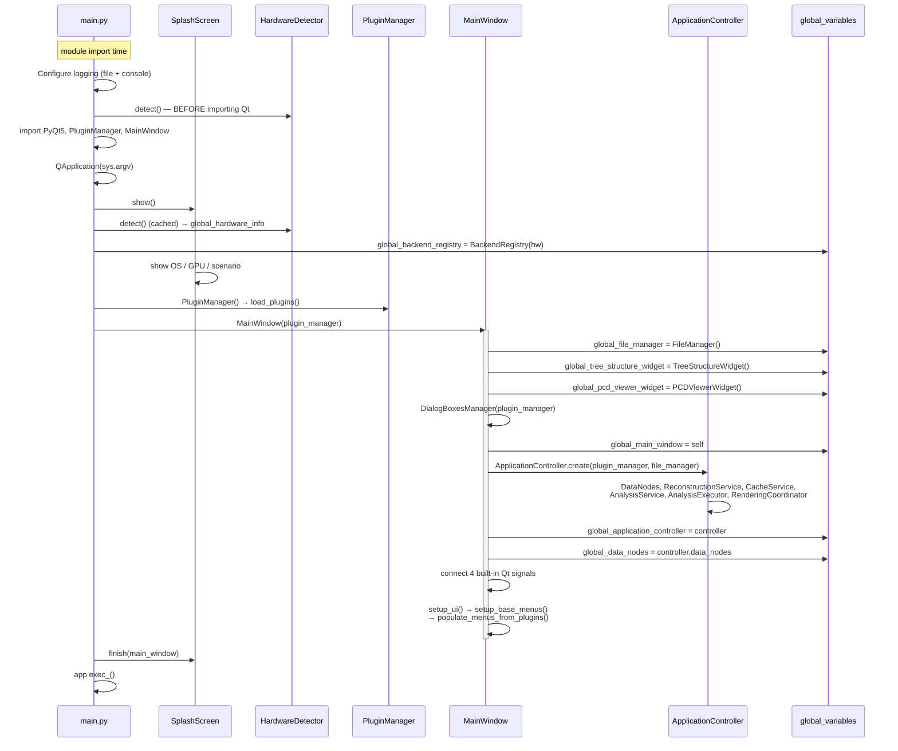
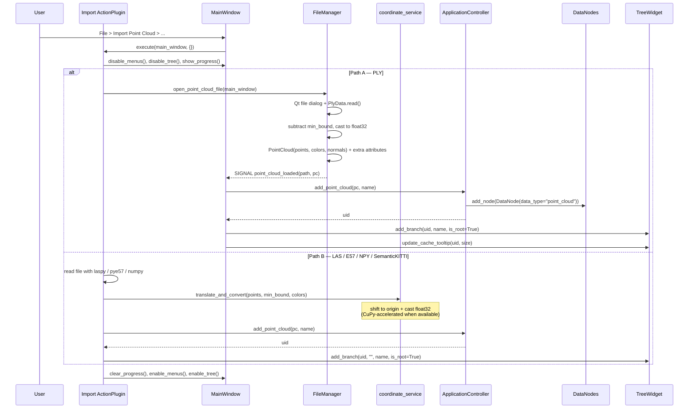
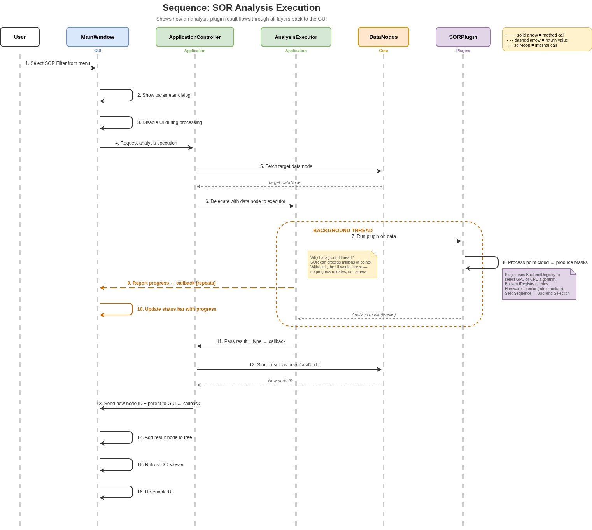
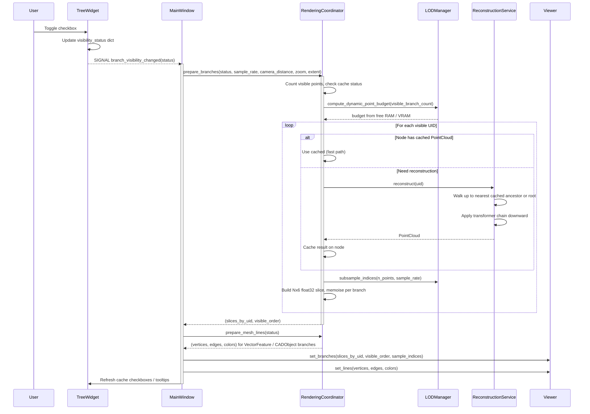
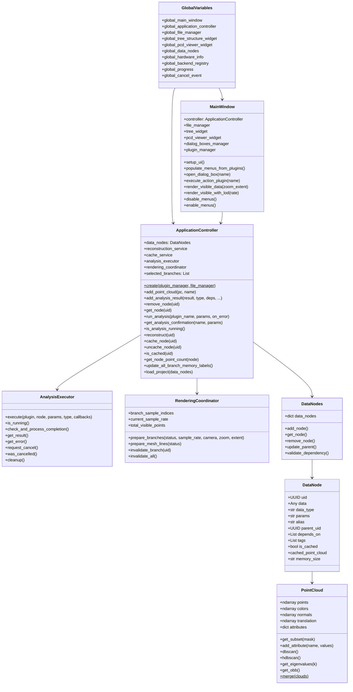
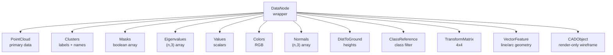
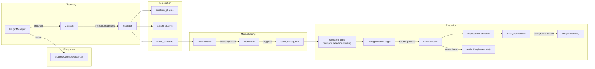

# SPCToolkit Architecture

This document describes the core framework architecture of SPCToolkit. It covers the main components, their relationships, and data flows.

> **Note:** Diagrams use [Mermaid](https://mermaid.js.org/) syntax. View in GitHub, VS Code with Mermaid extension, or [mermaid.live](https://mermaid.live).

---

## Table of Contents

1. [High-Level Overview](#1-high-level-overview)
2. [Initialization Sequence](#2-initialization-sequence)
3. [Data Flow: Loading a Point Cloud](#3-data-flow-loading-a-point-cloud)
4. [Data Flow: Running an Analysis](#4-data-flow-running-an-analysis)
5. [Data Flow: Visibility & Reconstruction](#5-data-flow-visibility--reconstruction)
6. [Component Relationships](#6-component-relationships)
7. [Plugin Integration](#7-plugin-integration)
8. [Quick Reference](#8-quick-reference)

---

## 1. High-Level Overview

The system is organized into layers: GUI, Application, Core, Infrastructure, and Plugins.




```mermaid
flowchart TD
    subgraph GUI["GUI Layer"]
        direction LR
        MW[MainWindow]
        TW[TreeStructureWidget]
        PV["PCDViewerWidget<br/>(picking, polygon select, LOD zoom)"]
        DB[DialogBoxesManager]
    end

    subgraph App["Application Layer"]
        direction LR
        AC[ApplicationController]
        AE[AnalysisExecutor]
        RC[RenderingCoordinator]
        LM[LODManager]
        PRN[PipelineRunner]
        SG[selection_gate]
    end

    subgraph Core["Core Layer"]
        direction LR
        subgraph CoreServices["Services"]
            RS[ReconstructionService]
            CS[CacheService]
            AS[AnalysisService]
            BP[BatchProcessor]
            GEO["Geometry: spatial_grid, neighbor_index,<br/>boundary_extraction, tracers, RANSAC"]
            PIPE["pipeline (capture / save / load)"]
        end
        subgraph Transformers["Transformers x10"]
            TF["Masks, Clusters, Values, Eigenvalues,<br/>Colors, DistToGround, ClassReference,<br/>Normals, TransformMatrix, Container"]
        end
        subgraph Entities
            DN["DataNodes / DataNode"]
            PC["PointCloud, Clusters, Masks, Values,<br/>VectorFeature, CADObject, …"]
        end
    end

    subgraph Infra["Infrastructure & Services"]
        direction LR
        FM[FileManager]
        HD[HardwareDetector]
        MM[MemoryManager]
        COORD[coordinate_service]
    end

    subgraph Plugins["Plugin Layer"]
        direction LR
        PM["PluginManager<br/>100 plugins / 15 menus"]
        AP[AnalysisPlugins]
        ActP[ActionPlugins]
        BR["BackendRegistry<br/>8 backend families"]
    end

    GUI --> App --> Core
    Plugins -.-> App
    Plugins -.-> Core
    Infra -.-> Core
```

> **Singleton access:** `global_variables` (config/config.py) provides global access to MainWindow, ApplicationController, TreeStructureWidget, PCDViewerWidget, FileManager, DataNodes, the hardware info and backend registry, plus two pieces of shared state — `global_progress` and `global_cancel_event`. Detailed component interactions are shown in the sequence diagrams below.

> **Generated diagrams:** `docs/architecture_diagrams.md` holds component / sequence / class / data-flow diagrams read straight from the source tree.

### Layer Responsibilities

| Layer | Purpose | Key Files |
|-------|---------|-----------|
| **GUI** | User interaction, visualization | `gui/main_window.py`, `gui/widgets/*`, `gui/widgets/pcd_viewer/*` |
| **Application** | Orchestration, coordination | `application/application_controller.py`, `analysis_executor.py`, `rendering_coordinator.py`, `lod_manager.py`, `pipeline_runner.py`, `selection_gate.py` |
| **Core Entities** | Data structures | `core/entities/point_cloud.py`, `clusters.py`, `masks.py`, `data_node.py`, `vector_feature.py` |
| **Core Services** | Reconstruction, caching, analysis, geometry | `core/services/reconstruction_service.py`, `cache_service.py`, `analysis_service.py`, `batch_processor.py`, `spatial_grid.py`, `pipeline.py` |
| **Core Transformers** | Replay derived data onto a PointCloud | `core/transformers/*.py` |
| **Infrastructure** | Hardware detection, memory management | `infrastructure/hardware_detector.py`, `infrastructure/memory_manager.py` |
| **Services** | File I/O, coordinates, colormaps, queries | `services/file_manager.py`, `coordinate_service.py`, `colormap_service.py`, `attribute_query.py` |
| **Plugins** | Extensible functionality, backends | `plugins/*/`, `plugins/backends/`, `plugins/plugin_manager.py` |

### Layer Dependencies (Clean Architecture)

- **GUI** → Application → Core (inward only)
- **Infrastructure** → Core
- **Plugins** → Application + Core (via `global_variables`)
- **Core** → NOTHING (no outward dependencies)

---

## 2. Initialization Sequence

Hardware is detected **before** PyQt5/OpenGL is imported (this avoids conflicts with the
PyCharm debugger's Qt support and lets CUDA libraries initialize first), then a splash screen
tracks the rest of startup.


```mermaid
sequenceDiagram
    participant M as main.py
    participant SP as SplashScreen
    participant HD as HardwareDetector
    participant PM as PluginManager
    participant MW as MainWindow
    participant AC as ApplicationController
    participant GV as global_variables

    Note over M: module import time
    M->>M: Configure logging (file + console)
    M->>HD: detect()  — BEFORE importing Qt
    M->>M: import PyQt5, PluginManager, MainWindow

    M->>M: QApplication(sys.argv)
    M->>SP: show()
    M->>HD: detect() (cached) → global_hardware_info
    M->>GV: global_backend_registry = BackendRegistry(hw)
    SP->>SP: show OS / GPU / scenario
    M->>PM: PluginManager()  → load_plugins()

    M->>MW: MainWindow(plugin_manager)
    activate MW
    MW->>GV: global_file_manager = FileManager()
    MW->>GV: global_tree_structure_widget = TreeStructureWidget()
    MW->>GV: global_pcd_viewer_widget = PCDViewerWidget()
    MW->>MW: DialogBoxesManager(plugin_manager)
    MW->>GV: global_main_window = self
    MW->>AC: ApplicationController.create(plugin_manager, file_manager)
    AC->>AC: DataNodes, ReconstructionService, CacheService,<br/>AnalysisService, AnalysisExecutor, RenderingCoordinator
    MW->>GV: global_application_controller = controller
    MW->>GV: global_data_nodes = controller.data_nodes
    MW->>MW: connect 4 built-in Qt signals
    MW->>MW: setup_ui() → setup_base_menus()<br/>→ populate_menus_from_plugins()
    deactivate MW

    M->>SP: finish(main_window)
    M->>M: app.exec_()
```

### Global Variables Assignment Locations

| Variable | Assigned In |
|----------|-------------|
| `global_hardware_info` | `main.py` (`initialize_hardware_and_backends`) |
| `global_backend_registry` | `main.py` (`initialize_hardware_and_backends`) |
| `global_file_manager` | `gui/main_window.py` |
| `global_tree_structure_widget` | `gui/main_window.py` |
| `global_pcd_viewer_widget` | `gui/main_window.py` |
| `global_main_window` | `gui/main_window.py` (set *before* the controller is created) |
| `global_application_controller` | `gui/main_window.py` |
| `global_data_nodes` | `gui/main_window.py` (from controller) |
| `global_progress` | initialized in `config/config.py`; written by worker threads |
| `global_cancel_event` | initialized in `config/config.py`; set by the Cancel button |

---

## 3. Data Flow: Loading a Point Cloud

Import is an **ActionPlugin** (`File > Import Point Cloud > …`). There are **two paths**, and
which one runs depends on the format:

| Path | Formats | Reader | How the branch is added |
|------|---------|--------|-------------------------|
| **A — via FileManager** | PLY | `plyfile` inside `FileManager.open_point_cloud_file()` | `point_cloud_loaded` signal → `MainWindow._on_point_cloud_loaded()` |
| **B — plugin-owned** | LAS/LAZ, E57, NPY/NPZ, SemanticKITTI | `laspy` / `pye57` / `numpy` inside the plugin | plugin calls `controller.add_point_cloud()` and `tree_widget.add_branch()` directly |


```mermaid
sequenceDiagram
    participant User
    participant IP as Import ActionPlugin
    participant MW as MainWindow
    participant FM as FileManager
    participant CS as coordinate_service
    participant AC as ApplicationController
    participant DN as DataNodes
    participant TW as TreeWidget

    User->>MW: File > Import Point Cloud > ...
    MW->>IP: execute(main_window, {})
    IP->>MW: disable_menus(), disable_tree(), show_progress()

    alt Path A — PLY
        IP->>FM: open_point_cloud_file(main_window)
        FM->>FM: Qt file dialog + PlyData.read()
        FM->>FM: subtract min_bound, cast to float32
        FM->>FM: PointCloud(points, colors, normals) + extra attributes
        FM-->>MW: SIGNAL point_cloud_loaded(path, pc)
        MW->>AC: add_point_cloud(pc, name)
        AC->>DN: add_node(DataNode(data_type="point_cloud"))
        AC-->>MW: uid
        MW->>TW: add_branch(uid, name, is_root=True)
        MW->>TW: update_cache_tooltip(uid, size)
    else Path B — LAS / E57 / NPY / SemanticKITTI
        IP->>IP: read file with laspy / pye57 / numpy
        IP->>CS: translate_and_convert(points, min_bound, colors)
        Note over CS: shift to origin + cast float32<br/>(CuPy-accelerated when available)
        IP->>AC: add_point_cloud(pc, name)
        AC-->>IP: uid
        IP->>TW: add_branch(uid, "", name, is_root=True)
    end

    IP->>MW: clear_progress(), enable_menus(), enable_tree()
```

### Key Points

- Import plugins own the UI lock; the reader lives either in `FileManager` (PLY only) or in the plugin
- **Every** importer shifts the cloud to the origin and casts to **float32** — there are no
  large-coordinate code paths downstream; the offset is kept on `PointCloud.translation` and
  re-applied on export via `ShiftDialog`
- Unknown PLY vertex properties (Intensity, GPS_Time, …) survive import as `PointCloud.attributes`
- Project load/save goes through `FileManager.load_project()` / `save_project()` and
  `ApplicationController.load_project(data_nodes)`, which rebuilds the whole tree

---

## 4. Data Flow: Running an Analysis

Analysis plugins run in a background thread to keep the UI responsive.



```mermaid
sequenceDiagram
    participant User
    participant MW as MainWindow
    participant SG as selection_gate
    participant DB as DialogBoxesManager
    participant AC as ApplicationController
    participant AE as AnalysisExecutor
    participant Thread as BackgroundThread
    participant Plugin
    participant TW as TreeWidget

    User->>MW: Click Analysis Menu Item
    MW->>SG: selection_kind(plugin_class)
    alt required selection missing
        MW->>User: non-modal SelectionPrompt
        User->>MW: select in viewer/tree → Continue
    end

    MW->>DB: get_analysis_params(plugin_name)
    DB->>DB: build_param_dialog() or DynamicDialog
    User->>DB: Enter params, click OK
    DB-->>MW: return params (direct call, no signal)

    MW->>AC: get_analysis_confirmation(name, params)
    AC->>Plugin: confirm_before_execute(node, params)
    Plugin-->>AC: warning or None
    alt warning
        MW->>User: Yes/No — proceed anyway?
    end

    activate MW
    MW->>MW: disable_menus(), disable_tree(), show Cancel
    MW->>AC: run_analysis(plugin_name, params, on_error)
    AC->>AE: execute(plugin, node, params, ...)
    MW->>MW: Start QTimer polling (100ms)
    deactivate MW

    activate Thread
    AE->>Thread: Start background thread
    Thread->>Thread: Reconstruct if needed, auto-cache parent
    Thread->>Plugin: execute(data_node, params)
    Plugin-->>Thread: return (result, type, deps)
    Thread->>AE: Mark completed (set flag)
    deactivate Thread

    Note over MW,Thread: cancel checks around each stage;<br/>Cancel button sets global_cancel_event

    MW->>AE: check_and_process_completion()
    AE-->>MW: Completed

    activate MW
    MW->>AC: add_analysis_result(result, type, deps, parent, ...)
    AC-->>MW: return uid
    MW->>TW: add_branch(uid, parent, name)
    MW->>MW: enable_menus(), enable_tree(), hide Cancel
    MW->>MW: _advance_pipeline_if_running()
    deactivate MW
```

### Threading Model

- **Thread Type:** Python `threading.Thread` (NOT QThread), daemon, one at a time
- **Communication:** flag polling via QTimer (100 ms) + callbacks for progress/completion/error
- **Progress:** `global_variables.global_progress = (percent, message)`, written in the worker, read by the timer
- **Cancellation:** the status-bar Cancel button calls `AnalysisExecutor.request_cancel()`, which sets
  both the executor's own event and `global_variables.global_cancel_event`; the worker checks it
  around reconstruction and `execute()`, and long-running plugins poll it themselves
- **Thread Safety:** plugins only READ data and return NEW objects
- **No Deep Copy:** memory efficient — relies on read-only access

---

## 5. Data Flow: Visibility & Reconstruction

When a user toggles visibility, derived data (masks, clusters, …) must be reconstructed to a
PointCloud for rendering. The coordinator hands the viewer **per-branch slices**, not one
concatenated array, so toggling a previously-shown branch reuses its existing VBO.


```mermaid
sequenceDiagram
    participant User
    participant TW as TreeWidget
    participant MW as MainWindow
    participant RC as RenderingCoordinator
    participant LM as LODManager
    participant RS as ReconstructionService
    participant PV as Viewer

    User->>TW: Toggle checkbox
    TW->>TW: Update visibility_status dict
    TW-->>MW: SIGNAL branch_visibility_changed(status)

    activate MW
    MW->>RC: prepare_branches(status, sample_rate, camera_distance, zoom, extent)

    activate RC
    RC->>RC: Count visible points, check cache status
    RC->>LM: compute_dynamic_point_budget(visible_branch_count)
    LM-->>RC: budget from free RAM / VRAM
    loop For each visible UID
        alt Node has cached PointCloud
            RC->>RC: Use cached (fast path)
        else Need reconstruction
            RC->>RS: reconstruct(uid)
            RS->>RS: Walk up to nearest cached ancestor or root
            RS->>RS: Apply transformer chain downward
            RS-->>RC: PointCloud
            RC->>RC: Cache result on node
        end
        RC->>LM: subsample_indices(n_points, sample_rate)
        RC->>RC: Build Nx6 float32 slice, memoise per branch
    end
    RC-->>MW: (slices_by_uid, visible_order)
    deactivate RC

    MW->>RC: prepare_mesh_lines(status)
    RC-->>MW: (vertices, edges, colors) for VectorFeature / CADObject branches
    MW->>PV: set_branches(slices_by_uid, visible_order, sample_indices)
    MW->>PV: set_lines(vertices, edges, colors)
    MW->>TW: Refresh cache checkboxes / tooltips
    deactivate MW
```

### Reconstruction Process

1. **Check Cache:** if the node has `cached_point_cloud`, use it immediately
2. **Find Ancestor:** walk up the tree looking for a cached ancestor or the root PointCloud
3. **Apply Transformers:** `ReconstructionService.transformer_registry` maps `data_type` → transformer
4. **Cache Result:** store the reconstructed PointCloud on the node for future use

> **Cache invalidation is wired with a callback, not a signal:** `ApplicationController.create()`
> registers a listener via `CacheService.add_invalidate_listener()`; when a uid's cache is dropped,
> `RenderingCoordinator.invalidate_branch(uid)` drops the matching vertex slice so the next render
> rebuilds it.

### Transformer Registry

| `data_type` | Transformer Class | Transformation |
|-------------|-------------------|----------------|
| `masks` | `MasksTransformer` | Filter points by boolean mask |
| `cluster_labels` | `ClustersTransformer` | Apply cluster / semantic colors |
| `values` | `ValuesTransformer` | Color by scalar values |
| `eigenvalues` | `EigenvaluesTransformer` | Color by eigenvalue features |
| `colors` | `ColorsTransformer` | Apply RGB colors |
| `dist_to_ground` | `DistToGroundTransformer` | Color by height above ground |
| `class_reference` | `ClassReferenceTransformer` | Filter / color by class reference |
| `normals` | `NormalsTransformer` | Attach normals to the cloud |
| `transform_matrix` | `TransformMatrixTransformer` | Apply a 4×4 transform |

> **Note:** `ContainerTransformer` also exists in `core/transformers/` as a pass-through for
> organizational nodes but is not registered in the default `transformer_registry`.
> `VectorFeature` and `CADObject` branches are never reconstructed into clouds — they render as
> line geometry through `prepare_mesh_lines()`.

### Level of Detail

`LODManager` (`application/lod_manager.py`) is pure and static. `compute_dynamic_point_budget()`
asks `MemoryManager.compute_unified_point_budget()` for the tighter of the RAM and VRAM limits —
25 bytes/point of RAM with a single visible branch, 49 with several (the viewer aliases one
branch's slice but must concatenate more than one), against 24 bytes/point of VRAM for the VBO.
`compute_sample_rate()` turns that budget plus camera distance/zoom into a rate, and
`subsample_indices()` draws the indices — on the GPU via CuPy when available, else NumPy.

---

## 6. Component Relationships

Static class diagram showing the main components and their relationships.


```mermaid
classDiagram
    class GlobalVariables {
        +global_main_window
        +global_application_controller
        +global_file_manager
        +global_tree_structure_widget
        +global_pcd_viewer_widget
        +global_data_nodes
        +global_hardware_info
        +global_backend_registry
        +global_progress
        +global_cancel_event
    }

    class MainWindow {
        +controller: ApplicationController
        +file_manager
        +tree_widget
        +pcd_viewer_widget
        +dialog_boxes_manager
        +plugin_manager
        +setup_ui()
        +populate_menus_from_plugins()
        +open_dialog_box(name)
        +execute_action_plugin(name)
        +render_visible_data(zoom_extent)
        +render_visible_with_lod(rate)
        +disable_menus()
        +enable_menus()
    }

    class ApplicationController {
        +data_nodes: DataNodes
        +reconstruction_service
        +cache_service
        +analysis_executor
        +rendering_coordinator
        +selected_branches: List
        +create(plugin_manager, file_manager)$
        +add_point_cloud(pc, name)
        +add_analysis_result(result, type, deps, ...)
        +remove_node(uid)
        +get_node(uid)
        +run_analysis(plugin_name, params, on_error)
        +get_analysis_confirmation(name, params)
        +is_analysis_running()
        +reconstruct(uid)
        +cache_node(uid)
        +uncache_node(uid)
        +is_cached(uid)
        +get_node_point_count(node)
        +update_all_branch_memory_labels()
        +load_project(data_nodes)
    }

    class AnalysisExecutor {
        +execute(plugin, node, params, type, callbacks)
        +is_running()
        +check_and_process_completion()
        +get_result()
        +get_error()
        +request_cancel()
        +was_cancelled()
        +cleanup()
    }

    class RenderingCoordinator {
        +prepare_branches(status, sample_rate, camera, zoom, extent)
        +prepare_mesh_lines(status)
        +invalidate_branch(uid)
        +invalidate_all()
        +branch_sample_indices
        +current_sample_rate
        +total_visible_points
    }

    class DataNodes {
        +dict data_nodes
        +add_node()
        +get_node()
        +remove_node()
        +update_parent()
        +validate_dependency()
    }

    class DataNode {
        +UUID uid
        +Any data
        +str data_type
        +str params
        +str alias
        +UUID parent_uid
        +List depends_on
        +List tags
        +bool is_cached
        +cached_point_cloud
        +str memory_size
    }

    class PointCloud {
        +ndarray points
        +ndarray colors
        +ndarray normals
        +ndarray translation
        +dict attributes
        +get_subset(mask)
        +add_attribute(name, values)
        +dbscan()
        +hdbscan()
        +get_eigenvalues(k)
        +get_obb()
        +merge(clouds)$
    }

    GlobalVariables --> MainWindow
    GlobalVariables --> ApplicationController
    MainWindow --> ApplicationController
    ApplicationController --> DataNodes
    ApplicationController --> AnalysisExecutor
    ApplicationController --> RenderingCoordinator
    DataNodes --> DataNode
    DataNode --> PointCloud
```

> `tags` on a DataNode is `[plugin_name, params]` for any node produced by an analysis plugin —
> that is what makes pipeline capture possible without extra bookkeeping (see PLUGIN_ARCHITECTURE.md §8).

### Data Type Hierarchy


```mermaid
flowchart TB
    DN["DataNode<br/>wrapper"]
    DN --> PC["PointCloud<br/>primary data"]
    DN --> CL["Clusters<br/>labels + names"]
    DN --> MA["Masks<br/>boolean array"]
    DN --> EV["Eigenvalues<br/>(n,3) array"]
    DN --> VA["Values<br/>scalars"]
    DN --> CO["Colors<br/>RGB"]
    DN --> NO["Normals<br/>(n,3) array"]
    DN --> DG["DistToGround<br/>heights"]
    DN --> CR["ClassReference<br/>class filter"]
    DN --> TM["TransformMatrix<br/>4x4"]
    DN --> VF["VectorFeature<br/>line/arc geometry"]
    DN --> CAD["CADObject<br/>render-only wireframe"]
```

> `VectorFeature` and `CADObject` are **render-only** payloads — viewport drawing geometry, not
> DXF export objects. They are drawn as line branches, never reconstructed into point clouds.

---

## 7. Plugin Integration

Plugins are discovered automatically from the folder structure and registered in menus.
**100 plugins** (69 Action, 31 Analysis) currently live across **15 top-level menus**.
Full reference: **PLUGIN_ARCHITECTURE.md**.


```mermaid
flowchart LR
    subgraph Filesystem
        PF["plugins/Category/plugin.py"]
    end

    subgraph Discovery
        PM[PluginManager]
        PM -->|walks| PF
        PM -->|importlib| Classes
        Classes -->|inspect.issubclass| Register
    end

    subgraph Registration
        Register --> analysis_plugins
        Register --> action_plugins
        Register --> menu_structure
    end

    subgraph MenuBuilding
        menu_structure --> MainWindow
        MainWindow -->|create QAction| MenuItem
        MenuItem -->|triggered| open_dialog_box
    end

    subgraph Execution
        open_dialog_box --> Gate["selection_gate<br/>prompt if selection missing"]
        Gate --> DialogBoxesManager
        DialogBoxesManager -->|returns params| MainWindow2[MainWindow]
        MainWindow2 --> ApplicationController
        ApplicationController --> AnalysisExecutor
        AnalysisExecutor -->|background thread| PluginExec["Plugin.execute()"]
        MainWindow2 -->|main thread| ActionExec["ActionPlugin.execute()"]
    end
```

### Plugin Types

| Type | Base Class | Execution | Returns |
|------|------------|-----------|---------|
| **AnalysisPlugin** | `Plugin` (alias `AnalysisPlugin`) | Background thread | `(result, type, deps)` |
| **ActionPlugin** | `ActionPlugin` | Main thread | `None` |

### Folder Structure = Menu Hierarchy

```
plugins/
├── 000_File/                        -> Menu: "File"
│   ├── 000_Import Point Cloud/      ->   Submenu: "Import Point Cloud"
│   └── 010_load_project_plugin.py   ->   "Load Project"
├── 010_View/                        -> Menu: "View"
│   └── 005_zoom_to_extent_plugin.py ->   "Zoom To Extent"
└── 020_Points/                      -> Menu: "Points"
    └── 020_Clustering/              ->   Submenu: "Clustering"
        └── 000_dbscan_plugin.py     ->     "DBSCAN"
```

Numbering (`000_`, `010_`, …) controls menu order. Folder depth controls menu nesting.

### Plugin Interfaces

```python
# Analysis Plugin (processes data in a worker thread, returns results)
class AnalysisPlugin(ABC):
    def get_name(self) -> str: ...
    def get_parameters(self) -> Dict[str, Any]: ...
    def execute(self, data_node, params) -> Tuple[result, type, deps]: ...
    # optional: confirm_before_execute(), requires_selection(), build_param_dialog()

# Action Plugin (performs actions on the main thread, no return)
class ActionPlugin(ABC):
    def get_name(self) -> str: ...
    def get_parameters(self) -> Dict[str, Any]: ...  # Can return {}
    def execute(self, main_window, params) -> None: ...
    # optional: requires_selection()
```

---

## 8. Quick Reference

### "I want to do X -> Look in Y"

| Task | Location |
|------|----------|
| Load a PLY point cloud | `FileManager.open_point_cloud_file()` |
| Load LAS / E57 / NPY | the matching plugin in `plugins/000_File/000_Import Point Cloud/` |
| Run an analysis plugin | `ApplicationController.run_analysis()` → `AnalysisExecutor.execute()` |
| Add a node to the tree | `MainWindow._on_point_cloud_loaded()` or `_handle_analysis_result()` |
| Render points in viewer | `RenderingCoordinator.prepare_branches()` → `PCDViewerWidget.set_branches()` |
| Render lines / wireframe | `RenderingCoordinator.prepare_mesh_lines()` → `PCDViewerWidget.set_lines()` |
| Create a new analysis plugin | `plugins/YourCategory/your_plugin.py` (inherit `AnalysisPlugin`) |
| Create a new action plugin | `plugins/YourCategory/your_plugin.py` (inherit `ActionPlugin`) |
| Require a selection before a run | override `requires_selection()`; helpers in `application/selection_gate.py` |
| Warn before a slow run | override `confirm_before_execute()` |
| Replace the param dialog | override `build_param_dialog()` |
| Access any global manager | `from config.config import global_variables` |
| Reconstruct a branch | `ApplicationController.reconstruct(uid)` |
| Get selected tree items | `ApplicationController.selected_branches` |
| Get the selected points | `application/selection_gate.selected_cloud_mask()` |
| Re-render visible data | `MainWindow.render_visible_data(zoom_extent=False)` |
| Report progress from a thread | `global_variables.global_progress = (percent, "msg")` |
| Support cancellation | poll `global_variables.global_cancel_event` |
| Disable UI during processing | `MainWindow.disable_menus()`, `disable_tree()` |
| Capture / replay a plugin sequence | `core/services/pipeline.py`, `application/pipeline_runner.py` |

### Signal Connections

Only **four** built-in Qt signal connections carry application data; everything else is a direct
call or a callback.

| Signal | Source | Handler | Purpose |
|--------|--------|---------|---------|
| `point_cloud_loaded` | FileManager | `MainWindow._on_point_cloud_loaded` | PLY file loaded |
| `branch_visibility_changed` | TreeStructureWidget | `MainWindow._on_branch_visibility_changed` | Checkbox toggled |
| `branch_added` | TreeStructureWidget | `MainWindow._on_branch_added` | New branch added |
| `branch_selection_changed` | TreeStructureWidget | `MainWindow._on_branch_selection_changed` | Tree selection |

> `FileManager` also declares `project_loaded` and `project_saved`, and `TreeStructureWidget`
> declares `branch_hierarchy_updated`, but nothing connects them today (they are emitted into the void). `DialogBoxesManager`
> declares `analysis_params` for backward compatibility only — the live path returns params
> directly from `get_analysis_params()`. **No plugin declares a custom signal.**

### Key Files

| File | Purpose |
|------|---------|
| `main.py` | Entry point — logging, pre-Qt hardware detection, splash, plugin load |
| `gui/main_window.py` | Main window, menu building, selection gate, analysis polling |
| `gui/widgets/pcd_viewer/` | OpenGL viewer split into mixins (rendering, camera, picking, polygon select, zoom window) |
| `gui/widgets/tree_structure_widget.py` | Branch tree, visibility and cache checkboxes |
| `gui/dialog_boxes/dynamic_dialog.py` | Schema-driven parameter form |
| `application/application_controller.py` | Central orchestrator (factory, reconstruct, selection) |
| `application/analysis_executor.py` | Background thread analysis execution + cancellation |
| `application/rendering_coordinator.py` | Per-branch vertex slices, cache, LOD application |
| `application/lod_manager.py` | Point budget and subsample index generation |
| `application/selection_gate.py` | `requires_selection` gate, prompt, selection readers |
| `application/pipeline_runner.py` | Replays a captured pipeline step by step |
| `core/entities/data_node.py` | Single data unit wrapper |
| `core/entities/data_nodes.py` | Collection manager |
| `core/entities/point_cloud.py` | Primary data structure |
| `core/entities/vector_feature.py` | Line / arc feature geometry (render-only) |
| `core/services/reconstruction_service.py` | Rebuilds PointCloud from derived data |
| `core/services/cache_service.py` | Cache management + invalidation listeners |
| `core/services/analysis_service.py` | Plugin execution service |
| `core/services/batch_processor.py` | Adaptive point-budget k-d tiling for large clouds |
| `core/services/spatial_grid.py`, `neighbor_index.py` | Shared spatial index services |
| `core/services/pipeline.py` | Pipeline capture / save / load (pure logic) |
| `core/services/ransac/` | RANSAC primitive fitting (see `core/services/RANSAC.md`) |
| `core/transformers/*.py` | Data type transformers for reconstruction |
| `services/file_manager.py` | PLY I/O and project save/load |
| `services/coordinate_service.py` | Origin shift / float32 conversion |
| `infrastructure/hardware_detector.py` | Hardware detection (GPU, RAPIDS, CuPy, memory) |
| `infrastructure/memory_manager.py` | Unified RAM/VRAM point budget |
| `plugins/plugin_manager.py` | Plugin discovery, registration, hot reload |
| `plugins/backends/backend_registry.py` | Backend selection (GPU/CPU), 8 families |
| `plugins/interfaces.py` | Plugin base classes |
| `config/config.py` | GlobalVariables singleton |
| `docs/architecture_diagrams.md` | Generated component / sequence / class / data-flow diagrams |

---

## Architectural Principles

1. **Singleton Pattern:** Use `global_variables` for inter-component communication (avoid custom signals)
2. **Background Threading:** Long operations run in threads with QTimer polling
3. **Plugin Extensibility:** Folder structure defines menu hierarchy
4. **Caching:** Reconstructed PointClouds are cached on DataNodes; invalidation propagates to the render cache via listeners
5. **Read-Only Threading:** Plugins only read data, return new objects
6. **GPU First:** Backends prefer CuPy / cuML / PyTorch CUDA; a CPU fallback is a reported choice, never a silent one
7. **float32 Everywhere:** Clouds are shifted to the origin on import; no large-coordinate handling downstream

---

## Communication Pattern

```
PREFERRED: Singleton Pattern
─────────────────────────────
global_variables.global_application_controller.reconstruct(uid)
global_variables.global_pcd_viewer_widget.update()
global_variables.global_main_window.render_visible_data()

ACCEPTABLE: Callbacks (when singleton doesn't fit)
──────────────────────────────────────────────────
component_a.process(on_complete=callback_function)

AVOID: Custom Qt Signals/Slots
──────────────────────────────
class MyClass(QObject):
    custom_signal = pyqtSignal()  # Don't do this
```

---

*Last updated: August 2026 — regenerated from the source tree.*
