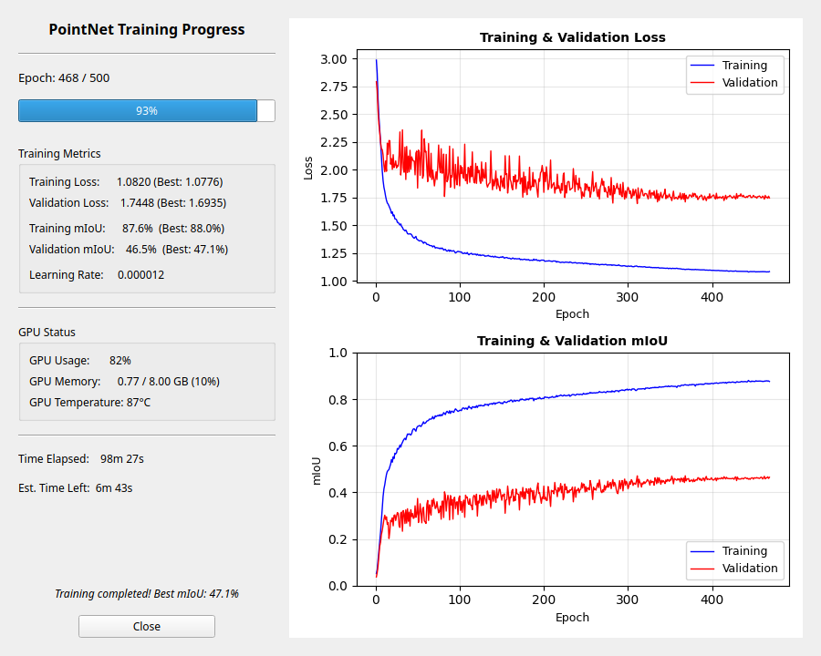

# SPCToolkit

[](LICENSE)

**An open-source, plugin-based research and development platform for point cloud processing.**

> **Beta Release** — SPCToolkit is under active development. Expect breaking changes, rough edges, and plenty of room to grow.

---

## What Is SPCToolkit?

SPCToolkit is a **research and development platform** for working with point cloud data. It is not a finished, feature-complete application — it is a foundation designed to give you a ready-made environment where you can build, test, and iterate on your own point cloud tools and workflows.

The toolkit ships with a set of basic built-in functionalities — loading, viewing, filtering, clustering — enough to get you working with data immediately. But these are not the point. They are there to demonstrate the platform and get you started. The real purpose of SPCToolkit is to provide you with a platform where you can develop and plug in your own research and development functionality, without having to build the surrounding infrastructure from scratch.

If you are developing a new segmentation algorithm, experimenting with classification models, prototyping a custom filter, or building a processing pipeline for a specific use case — SPCToolkit gives you the platform to do it.

## Why SPCToolkit?

Real-world point clouds are massive. Terrestrial LiDAR scans routinely produce hundreds of millions of points — volumes that push even high-end workstations to their limits. Most existing tools either choke on datasets of this scale or lock critical functionality behind expensive licences.

SPCToolkit takes a different approach. Rather than loading an entire dataset into memory, it provides intelligent access to point cloud data — letting you navigate, query, and process real-scale scans without requiring hardware that can hold it all at once. It adapts to your system and operating system, so you can work with production-size data on the machine you already have.

This means your R&D work happens on real data at real scale, not on downsampled toy datasets.

## Build Exactly What You Need

This is SPCToolkit's core strength: **you can create and add the functionality you need, with minimal effort.**

The toolkit is built on a plugin architecture. Every feature you see — loading a project, importing points, running DBSCAN — is a plugin. Plugins follow a simple abstract class structure, meaning there's a clear, consistent pattern for building your own. Implement the plugin base class in a `.py` file, drop it into the plugin directory, and it becomes part of the toolkit. No complex build steps, no framework lock-in — just Python and a well-defined interface.

Whether you need a custom segmentation algorithm, a specialised filter, a new visualisation mode, or an export pipeline for your specific workflow, you can build it as a plugin and have it running inside SPCToolkit in minutes.

## Key Features

- **R&D-first design** — Built as a platform for developing your own tools, not just running pre-built ones. Basic features are included to get you started; the rest is yours to build.
- **Plugin-first architecture** — Every feature is a plugin built on a shared abstract class. Creating custom functionality is straightforward and self-contained.
- **Built for real-scale data** — Works with point clouds of hundreds of millions of points without requiring all data in memory at once.
- **Hardware-adaptive** — Adjusts to available system resources, making real-world scan data accessible on any machine.
- **Camera flythrough** — Animate the camera along a smooth Catmull-Rom spline path through named waypoints. Multiple flythroughs can be saved per project. Ideal for screen-recorded demos and presentations.
- **Cross-platform** — Runs on Windows, Linux, and macOS.
- **Open and extensible** — Write custom plugins tailored to your specific research or production needs with minimal boilerplate.

## Semantic Segmentation Results

PointNet segmentation trained on [SemanticKITTI](http://www.semantic-kitti.org/) with 14 classes, 9 features (XYZ, normals, eigenvalues), and 2,577 training blocks — all within SPCToolkit's built-in training pipeline.

<p align="center">
  
</p>

| Class | IoU | | Class | IoU |
|-------|-----|-|-------|-----|
| Parking | **80.0%** | | Building | **76.4%** |
| Vegetation | **71.2%** | | Pole | **61.6%** |
| Trunk | **60.9%** | | Road | **59.8%** |
| Car | **53.0%** | | Terrain | **44.7%** |
| Sidewalk | **46.2%** | | Other-object | **41.5%** |
| Traffic-sign | **35.2%** | | Fence | **23.6%** |

> **Best validation mIoU: 47.1%** across 14 classes including challenging categories like other-ground and other-structure.

## Installation

### Prerequisites

- Python 3.9+
- A GPU with CUDA support is recommended but not required

### Setup

```bash
# Clone the repository
git clone https://github.com/Sepehr-Sobhani-AU/SPCToolkit.git
cd SPCToolkit

# Create a virtual environment (recommended)
python -m venv venv
source venv/bin/activate  # Linux/macOS
# venv\Scripts\activate   # Windows

# Install dependencies
pip install -r requirements.txt
```

### Optional: GPU Acceleration

For NVIDIA GPU users, install additional packages for full GPU acceleration:

```bash
# CuPy for GPU array operations
pip install cupy-cuda12x

# pynvml for GPU monitoring
pip install pynvml

# RAPIDS cuML for GPU-accelerated DBSCAN/KNN (Linux only)
# See https://docs.rapids.ai/install for installation instructions
pip install cuml
```

## Quick Start

```bash
python main.py
```

1. **Import a point cloud**: File > Import Point Cloud > choose format (PLY, LAS, E57, etc.)
2. **Navigate**: Left-click to rotate, right-click to pan, scroll to zoom, press **F** to fit view
3. **Analyze**: Points > Analysis > Compute Eigenvalues for geometric features
4. **Cluster**: Points > Clustering > DBSCAN to segment the point cloud
5. **Classify**: Use geometric classification or train a PointNet model under ML Models
6. **Flythrough**: View > Flythrough — navigate to a camera angle, click **Add Waypoint**, repeat, then hit **Play** for a smooth animated path
7. **Save**: File > Save Project to preserve your work as a `.pcdtk` project file

For a detailed walkthrough, see the [Getting Started Guide](GETTING_STARTED.md).

## Viewer Controls

| Input | Action |
|-------|--------|
| Left Click + Drag | Rotate |
| Ctrl + Left Click | Rotate around Z axis |
| Right/Middle Click + Drag | Pan |
| Double Left Click | Set rotation center on clicked point |
| Scroll Wheel | Zoom |
| **F** | Zoom to extent |
| **Ctrl + R** | Reset camera |
| **Shift + Left Click** | Select point |
| **P** | Polygon selection mode |
| **Z** | Zoom window mode |
| **C** | Cut cluster |
| **M** | Merge clusters |
| **Delete** | Remove clusters |
| **+/-** | Increase/decrease point size |

## Plugin System

SPCToolkit uses a folder-based plugin architecture. Plugins are automatically discovered and organized into menus based on their directory structure:

```
plugins/
  010_File/
    000_import_ply_plugin.py      # File > Import Point Cloud > PLY
    100_save_project_plugin.py    # File > Save Project
  020_Points/
    010_Subsampling/
      000_subsampling_plugin.py   # Points > Subsampling > Subsampling
    030_Analysis/
      000_eigenvalues_plugin.py   # Points > Analysis > Compute Eigenvalues
```

Creating a new plugin is as simple as implementing the `AnalysisPlugin` or `ActionPlugin` interface and placing the file in the appropriate directory.

For full details, see [Plugin Architecture](PLUGIN_ARCHITECTURE.md).

## Architecture

SPCToolkit follows a layered architecture with clear separation of concerns:

- **GUI Layer** — PyQt5 widgets, OpenGL viewer, dialog management
- **Application Layer** — Controllers, executors, rendering coordination
- **Core Layer** — Data entities, services, transformers
- **Plugin Layer** — Analysis and action plugins with backend abstraction

For the complete architecture documentation, see [Architecture](ARCHITECTURE.md).

## Contributing

Contributions are welcome! Please see [CONTRIBUTING.md](CONTRIBUTING.md) for guidelines on how to get started.

## License

This project is licensed under the MIT License — see the [LICENSE](LICENSE) file for details.
