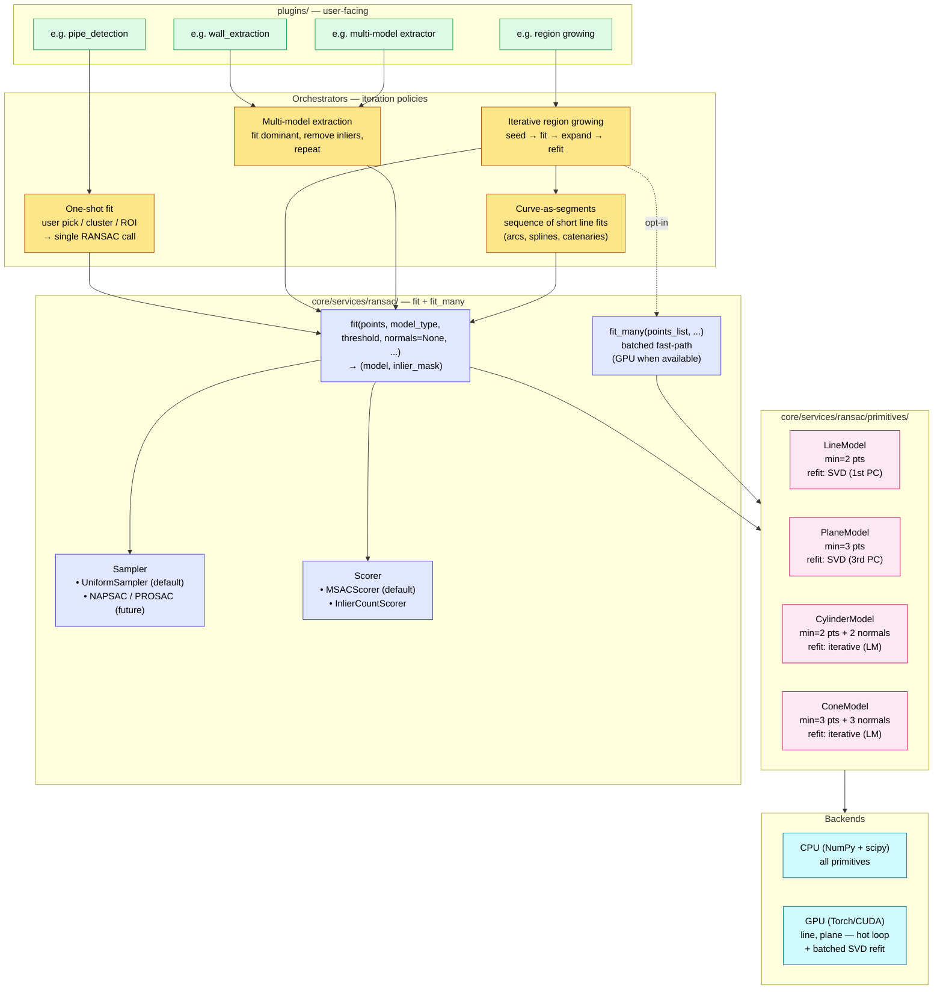

# RANSAC Module

The RANSAC infrastructure lives at `core/services/ransac/`. It implements the design ratified in `DECISIONS.md` 2026-05-26: a single-cloud `fit()` contract, model-owned refit, pluggable sampler/scorer, and an extensible primitive set covering line, plane, cylinder, and cone.

The guiding principle: **RANSAC's contract is "single point set in, single model out."** Region growing, voxel iteration, multi-model extraction, and curve-along-segments are orchestration above RANSAC, not variations of it. The infrastructure draws that line explicitly.

---

## Architecture



### Layer responsibilities

| Layer            | Responsibility                                                                                | Does NOT concern itself with                  |
|------------------|-----------------------------------------------------------------------------------------------|-----------------------------------------------|
| **Plugin**       | User interaction, parameter dialogs, tree branch creation                                     | RANSAC, iteration policy, backends            |
| **Orchestrator** | Where points come from, how to iterate, bookkeeping                                           | How a single fit is computed                  |
| **Engine**       | `fit` / `fit_many` contract: given points, find best model + inliers                          | What the points represent, what happens next  |
| **Model**        | Minimal-sample fit, distance function, **refit on inliers**, degeneracy reporting             | Sampling strategy, scoring strategy           |
| **Backend**      | NumPy or Torch tensor ops                                                                     | Geometry; receives operations from primitives |

---

## Primitives

### Status

| Primitive | CPU `fit`    | GPU `fit` (≥ 50 k pts) | Batched `fit_many` | Normals      |
|-----------|--------------|------------------------|---------------------|--------------|
| Line      | ✓ (Phase A)  | ✓ (Phase B)            | ✓ (Phase B, GPU)    | optional     |
| Plane     | ✓ (Phase A)  | ✓ (Phase B)            | ✓ (Phase B, GPU)    | optional     |
| Cylinder  | ✓ (Phase C)  | — (future)             | CPU fallback        | **required** |
| Cone      | ✓ (Phase C)  | — (future)             | CPU fallback        | **required** |

### Geometry

| Primitive | State                                            | Minimal fit (no normals) | Minimal fit (with normals)                 | Refit                |
|-----------|--------------------------------------------------|--------------------------|--------------------------------------------|----------------------|
| Line      | `point`, `direction` (unit)                      | 2 pts                    | 2 pts                                      | SVD (1st PC)         |
| Plane     | `point`, `normal` (unit)                         | 3 pts                    | not implemented (would be 1 pt + normal)   | SVD (3rd PC)         |
| Cylinder  | `point`, `direction` (unit), `radius`            | 5 pts (not implemented)  | **2 pts + 2 normals** (closed-form)        | Levenberg–Marquardt  |
| Cone      | `apex`, `axis` (unit), `half_angle` (rad)        | 6 pts (not implemented)  | **3 pts + 3 normals** (tangent-plane linear solve) | Levenberg–Marquardt  |

Cylinder and cone refit is iterative (`scipy.optimize.least_squares(..., method='lm')`), which does not vectorise across rows on GPU. A GPU batched hot loop with CPU per-row refit is plausible but unbuilt; it lands only if a real workload demands it.

Curves (arcs, splines, catenaries) are **out of scope as RANSAC primitives** — they are approximated as sequences of line segments by an iterative orchestrator (the curve-as-segments pattern).

---

## Public API

```python
from core.services.ransac import fit, fit_many

model, inlier_mask = fit(
    points,                 # (N, 3) np.ndarray
    model_type,             # "line" | "plane" | "cylinder" | "cone"
    threshold,              # float — distance threshold
    normals=None,           # (N, 3) — required for cylinder/cone
    max_iterations=1000,
    min_inlier_ratio=0.3,
    sampler=None,           # CPU only; default UniformSampler
    scorer=None,            # CPU only; default MSACScorer
    seed=None,
    backend="auto",         # "auto" | "cpu" | "gpu"
)

models, masks = fit_many(
    points_list,            # list[np.ndarray (N_b, 3)] of length B
    model_type,
    threshold,
    normals_list=None,
    max_iterations=1000,
    min_inlier_ratio=0.3,
    seed=None,
    backend="auto",
)
```

### Example

```python
import numpy as np
from core.services.ransac import fit

points = np.load("some_cluster.npy")              # (N, 3)
model, inlier_mask = fit(points, "plane", threshold=0.05, seed=0)

if model is None:
    print("no plane found")
else:
    print(f"normal = {model.normal}, inliers = {int(inlier_mask.sum())} / {len(points)}")
```

### Backend dispatch (`backend="auto"`)

- `fit`: GPU when CUDA is available **and** `N ≥ 50_000` and the primitive sets `supports_gpu = True`. Below 50 k points host↔device transfer dominates, so CPU wins; the threshold is a constant in `engine.py` and easy to tune.
- `fit_many`: GPU when CUDA is available and the primitive sets `supports_gpu = True`, regardless of row size (the parallelism wins). Falls back to a sequential CPU loop otherwise.
- Cylinder and cone always run on CPU because `supports_gpu = False`.
- Explicit `backend="gpu"` on a model that doesn't support GPU raises a clean `RuntimeError`.
- The GPU path runs in `float64` internally (chosen for SVD stability). On consumer GeForce GPUs, fp64 throughput is roughly 1/32 of fp32, so very large `fit_many` workloads on those cards may underperform expectations — a fp32 mode is future work (see Open questions).

### Failure semantics

`fit` returns `(None, None)` when no candidate model satisfies `int(inlier_mask.sum()) >= max(min_samples, N * min_inlier_ratio)`. `fit_many` returns parallel lists in which failed rows are `None`. The orchestrator decides what to do — skip the voxel, stop region growth, drop the cluster, return what's been collected so far. The engine never raises for "no fit found"; it raises only for input shape errors, unknown `model_type`, missing-required-normals, or `backend="gpu"` against an unsupported model.

### Reproducibility across backends

The CPU path samples via `numpy.random.default_rng(seed)`; the GPU path samples via `torch.Generator(device='cuda').manual_seed(seed)`. Same input + same `seed` → identical results **within a backend**, but the two backends use different random streams, so CPU and GPU results on the same `seed` are not bit-exact. Geometric agreement (direction / normal / inlier count) within numerical tolerance is what `test_cpu_gpu_parity.py` verifies.

### Orchestrator contract

`fit` and `fit_many` take raw arrays, not `PointCloud` objects. The orchestrator is responsible for:

- selecting the points before the call (user pick, cluster filter, KD-tree neighbourhood, voxel contents, ROI, mask, …),
- supplying matching normals when the model requires them,
- mapping the returned inlier mask back to its own indexing,
- deciding what to do on failure (skip this voxel, stop growing, return partial result, …).

---

## Package layout

```
core/services/ransac/
    __init__.py        # public re-exports
    engine.py          # fit, fit_many, backend dispatch, GPU loop
    base.py            # RansacModel / Sampler / Scorer ABCs
    samplers.py        # UniformSampler
    scorers.py         # MSACScorer (default), InlierCountScorer
    primitives/
        __init__.py
        line.py        # LineModel       (CPU + GPU batched)
        plane.py       # PlaneModel      (CPU + GPU batched)
        cylinder.py    # CylinderModel   (CPU only; LM refit via scipy)
        cone.py        # ConeModel       (CPU only; LM refit via scipy)
```

Each primitive carries both the CPU single-cloud methods (`fit_minimal`, `distances`, `refit`) and, when `supports_gpu = True`, four batched GPU classmethods (`fit_minimal_batched_gpu`, `distances_batched_gpu`, `refit_batched_gpu`, `unpack_to_model`). Refit logic lives on the model so each primitive owns its own least-squares routine: SVD on CPU and `torch.linalg.svd` on GPU for line/plane; `scipy.optimize.least_squares` with `method='lm'` for cylinder/cone.

### Adding a new primitive

External primitives plug in via `register_model(name, cls)` in `engine.py`. To add one:

1. Subclass `RansacModel` from `base.py`.
2. Set the three class attributes: `requires_normals`, `min_samples`, `supports_gpu`.
3. Implement the CPU abstracts: `fit_minimal(points, normals)`, `distances(points)`, `refit(inlier_points, inlier_normals)`. Each returns `False` on degeneracy so the engine can skip / fall back.
4. If `supports_gpu = True`, also implement the four batched classmethods: `fit_minimal_batched_gpu`, `distances_batched_gpu`, `refit_batched_gpu`, `unpack_to_model`. The state dict is opaque to the engine — pick whatever keys make sense for the primitive.
5. Call `register_model("my_shape", MyShapeModel)` once at import time. `fit("my_shape", ...)` and `fit_many("my_shape", ...)` then work without engine changes.

`LineModel` is the smallest concrete example of the full CPU + GPU contract; `CylinderModel` shows the CPU-only case with an iterative refit.

---

## Algorithmic baseline

- **Sampler:** uniform random by default (`UniformSampler`). Sampler is a pluggable CPU-side interface so NAPSAC (spatial locality) or PROSAC (quality-weighted) can be added when a real scenario demands them. The GPU path hardcodes uniform sampling — custom samplers are CPU-only by design.
- **Scorer:** MSAC truncated-quadratic loss by default (`MSACScorer`). Strictly better than binary inlier counting at no extra cost: residuals contribute `min(d², threshold²)`, so the score degrades continuously across the inlier boundary (the loss has a kink at `d = threshold` but no step discontinuity, unlike inlier-count). `InlierCountScorer` is provided for parity comparisons and debugging.
- **Refinement (LO-style):** after the random-sample loop picks a best hypothesis, the engine calls `model.refit(inliers)` to refine on the full inlier set, then re-evaluates inliers against the refined model. If refit reports degeneracy, the engine falls back to the pre-refit minimal model so the caller still gets a usable result.

---

## Orchestration patterns

The patterns below describe how plugins are expected to use `fit` / `fit_many`. **None of these orchestrators ship inside `core/services/ransac/` today** — they are conventions consumers (plugins) implement on top of the engine. The diagram shows them inside the Orchestrators band to make the layering clear, not to imply existing code.

1. **One-shot fit** — single `fit` call, e.g. user selects a cluster and asks "fit a cylinder to this."
2. **Iterative region growing** — seed region → fit → expand by inlier reach → refit on expanded set → repeat. The shape that "find a plane in a voxel, grow it to neighbours" or "trace a pipe along its axis" both follow.
3. **Multi-model extraction** — fit dominant model, mark inliers, recurse on remaining points. The shape for "find all walls" or "find all pipes in this scan."
4. **Curve-as-segments** — special case of (2): fit a short line segment, advance, fit the next segment. A sequence of `LineModel` fits captures arcs, splines, and catenaries without dedicated primitives.

---

## Tests

`unit_test/ransac/` — plain Python scripts (`python unit_test/ransac/test_*.py`):

| File                          | Coverage                                                                       |
|-------------------------------|--------------------------------------------------------------------------------|
| `test_line_fit.py`            | CPU line: recovery, pure-noise rejection, reproducibility, too-few-points     |
| `test_plane_fit.py`           | CPU plane: recovery, collinear-input rejection, pure-noise, reproducibility   |
| `test_cylinder_fit.py`        | CPU cylinder: recovery (asserts radius relative error < 1 %), normals-required, reproducibility |
| `test_cone_fit.py`            | CPU cone: recovery (asserts half-angle absolute error < 0.01 rad), cone-vs-cylinder discrimination |
| `test_fit_many.py`            | `fit_many` across mixed pass/fail rows; runs on whichever backend is available |
| `test_gpu_fit_line.py`        | GPU line; skipped cleanly without CUDA                                         |
| `test_gpu_fit_plane.py`       | GPU plane; skipped cleanly without CUDA                                        |
| `test_cpu_gpu_parity.py`      | CPU and GPU agree on direction/normal and inlier count for same input         |

---

## Open questions and future work

- **Per-point weights as a first-class engine input.** Useful for MSAC scoring with point-confidence priors and for future PROSAC sampling. Cheap to wire in now (`fit(..., weights=None)`), expensive to retrofit later. Not yet built.
- **NAPSAC / PROSAC samplers.** Both are well-understood; NAPSAC is more aligned with point-cloud data (spatial locality) than PROSAC (quality-weighted) because raw point clouds don't carry an obvious quality signal without extra precomputation.
- **GPU batched cylinder/cone.** Closed-form minimal fit and distance functions vectorise fine; the iterative LM refit does not. A workable approach: GPU hot loop + per-row CPU LM refit on the survivors. Defer until a real workload demonstrates the need.
- **Curve-as-segments helper as a shared service.** No orchestrator currently implements this pattern in the new infrastructure; once the first consumer ships and a second appears, promoting the shared step-and-fit loop to a utility makes sense.
- **Single-sheet cone restriction.** Both sheets of the infinite double-cone are currently treated as one surface. Adding a "wide-end only" mask filter is a one-line change if a consumer needs it.
- **Backend-registry integration.** `core/services/ransac` currently dispatches CPU/GPU in-module via `torch.cuda.is_available()`. Routing through `global_backend_registry.get_ransac()` would only matter if something outside this package needs to choose a RANSAC backend declaratively — no consumer does today.

---

## Design lineage

- **`DECISIONS.md` 2026-05-26** — ratified the single-cloud contract, model-owned refit, pluggable sampler/scorer, four-primitive scope, and out-of-scope items (splines, catenaries, arcs as primitives).
- **Phase A** (commit `7382ff0`) — package skeleton + CPU line and plane.
- **Phase B** (commit `cecb9ab`) — GPU backend and `fit_many` for line and plane.
- **Phase C** (commit `20bf7a9`) — CPU cylinder and cone with LM refit.
