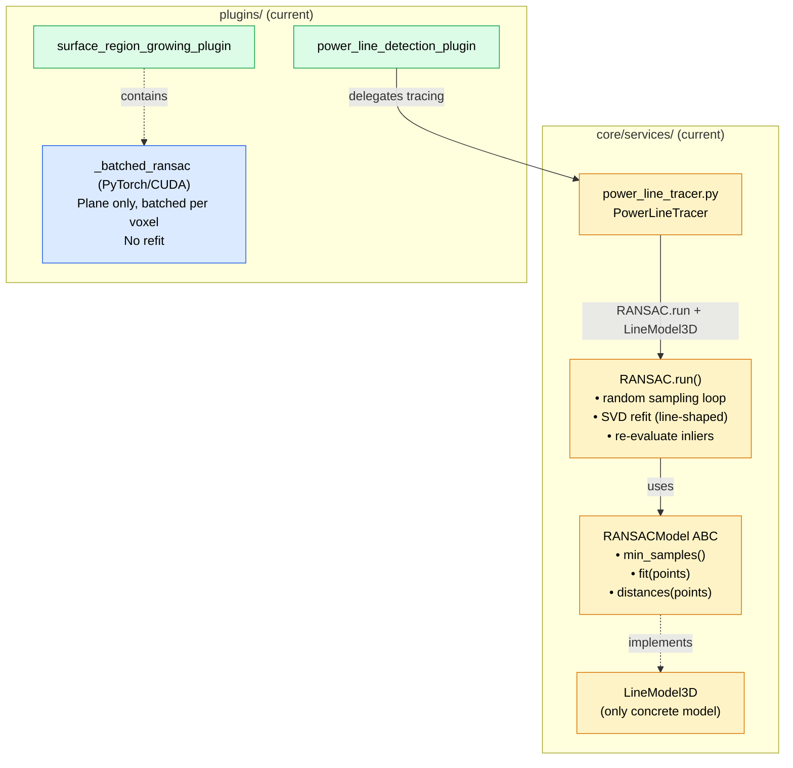
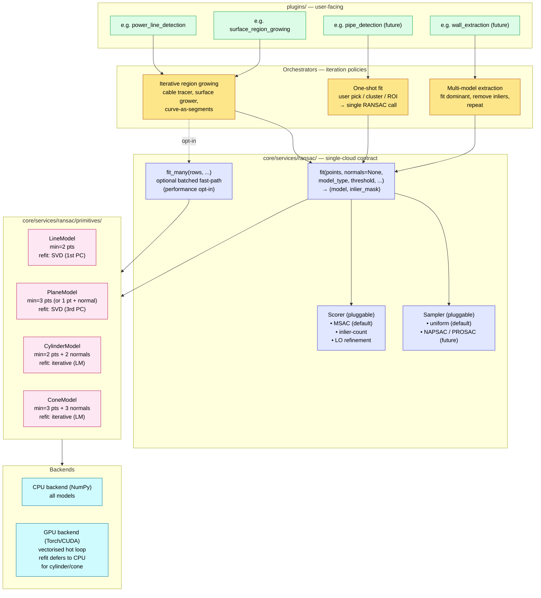

# RANSAC Module

This file documents both the **current state** of RANSAC in the codebase and the **proposed infrastructure design** discussed for consolidating it. The proposed design has not been ratified in a Definition session yet — it is captured here as design intent, not a committed plan.

---

## Part 1 — Current state

The project today contains two disconnected RANSAC implementations:

1. A small CPU engine in `core/services/ransac.py` (NumPy, line model only).
2. A bespoke batched GPU plane-RANSAC fused into the surface-region-growing plugin (PyTorch/CUDA).



**Known structural issues with the current code:**

- The `RANSACModel` ABC advertises generality but `RANSAC.run()`'s SVD refit hard-codes line geometry — no other primitive can slot in without rewriting the engine.
- `_batched_ransac` is a reusable primitive trapped inside a 1000-line plugin file; any future plane-fitting consumer would have to import from a plugin or duplicate the code.
- The CPU engine cannot satisfy the project's "maximize GPU usage" rule, so the canonical implementation is structurally non-compliant for any non-trivial workload.
- `_batched_ransac` skips inlier-refit entirely — every accepted plane is defined by 3 random points, never refined.
- No shared plane primitive exists in `core/services/`, despite plane fitting being the most common RANSAC use case in point clouds.

---

## Part 2 — Proposed design

### Guiding principle

RANSAC's contract is **single point set in, single model out**. Region growing, voxel iteration, multi-model extraction, curve-along-segments — all of these are **orchestration** above RANSAC, not variations of it. The infrastructure draws that line explicitly.

### Layered architecture



### Layer responsibilities

| Layer | Responsibility | Does NOT concern itself with |
|-------|----------------|------------------------------|
| **Plugin** | User interaction, parameter dialogs, tree branch creation | RANSAC, iteration policy, backends |
| **Orchestrator** | Where points come from, how to iterate (region growth, multi-model loop, curve-as-segments), bookkeeping | How a single fit is computed |
| **Engine** | `fit` contract: given points, find best model + inliers | What the points represent, what happens next |
| **Model** | Minimal-sample fit, distance function, **refit on inliers**, degeneracy check | Sampling strategy, scoring strategy |
| **Backend** | NumPy or Torch tensor ops | Geometry; receives operations from primitives/engine |

### Canonical contract

```
fit(
    points: array (N, 3),
    model_type: "line" | "plane" | "cylinder" | "cone",
    threshold: float,
    normals: array (N, 3) | None,
    max_iterations: int,
    backend: "auto" | "cpu" | "gpu",
    sampler: Sampler = UniformSampler(),
    scorer: Scorer = MSACScorer(),
) -> (model, inlier_mask)  or  (None, None) on failure
```

The orchestrator is responsible for:
- selecting the points before the call (user pick, cluster filter, KD-tree neighbourhood, voxel contents, ROI, mask, …),
- mapping the returned inlier mask back to its own indexing,
- deciding what to do on failure (skip this voxel, stop growing, return partial result, …).

### Primitive set (initial scope)

Four primitives cover the vast majority of as-built point-cloud features: structural elements, MEP, and linear infrastructure.

| Primitive | Min sample (no normals) | Min sample (with normals) | Refit method |
|-----------|------------------------|--------------------------|--------------|
| Line      | 2 pts                  | 2 pts                    | SVD (1st PC) |
| Plane     | 3 pts                  | 1 pt + normal            | SVD (3rd PC) |
| Cylinder  | 5 pts (fragile)        | **2 pts + 2 normals**    | iterative (LM) |
| Cone      | 6 pts (very fragile)   | **3 pts + 3 normals**    | iterative (LM) |

Curves (arcs, splines, catenaries) are **out of scope as RANSAC primitives** — they are approximated as sequences of line segments by an iterative orchestrator, the same pattern `PowerLineTracer` already uses.

### Batched fast-path (`fit_many`)

A performance opt-in for orchestrators that need to fit thousands of small models in parallel (the surface-region-growing case). Same model contract, same threshold, same options — only the input shape changes (rows of point sets) and the output shape changes (rows of models). The basic single-cloud `fit` contract is unaffected. Most consumers will never call `fit_many`.

### Algorithmic baseline

- **Sampler:** uniform random by default. Sampler is a pluggable interface so NAPSAC (spatial locality) or PROSAC (quality-weighted) can be added later when a real scenario demands them.
- **Scorer:** MSAC (truncated-quadratic loss) by default — strictly better than binary inlier counting at no extra cost, handles noisy thresholds gracefully.
- **Refinement:** LO-style — refit best hypothesis on all its inliers before final inlier evaluation. Refit logic lives **on each model**, not in the engine.

### Orchestration patterns the engine supports

1. **One-shot fit** — single call, e.g. user selects a cluster and asks "fit a cylinder to this."
2. **Iterative region growing** — seed region → fit → expand by inlier reach → refit on expanded set → repeat. Used by cable tracing (line) and surface growing (plane). Same pattern works for pipe tracing (cylinder).
3. **Multi-model extraction** — fit dominant model, mark inliers, recurse on remaining points. Used for "find all walls" or "find all pipes in this scan."
4. **Curve-as-segments** — special case of (2): fit a short line segment, advance, fit the next segment. Sequence of `LineModel` fits captures arcs, splines, catenaries without dedicated primitives.

---

## Part 3 — Open design decisions

These belong in a Definition session, not a Construction one. Listed for visibility:

1. **Migration vs coexistence.** Does the new infrastructure replace `_batched_ransac` and `RANSAC.run` immediately, or do they coexist during a transition? Replacement is cleaner; coexistence is lower risk.
2. **`fit_many` from day one?** Defining it in the engine ABC now (even if only `PlaneModel` implements it initially) avoids a later interface change. Alternative: ship single-cloud `fit` first, add `fit_many` only when the surface plugin is migrated.
3. **Where does the curve-as-segments helper live?** It is shared between cable tracing and any future curved-pipe / curved-cable scenario. Build it as a service when the second consumer arrives, not before.
4. **Per-point weights as a first-class engine input?** Useful for MSAC scoring with point confidence, and for future PROSAC sampling. Cheap to include now, expensive to add later.

---

## Part 4 — File references (current code)

- `core/services/ransac.py` — engine + `LineModel3D` (CPU, NumPy)
- `core/services/power_line_tracer.py` — line-RANSAC consumer (region-growing orchestrator)
- `plugins/060_Infrastructure/000_power_line_detection_plugin.py` — power-line plugin entry
- `plugins/020_Points/020_Clustering/030_surface_region_growing_plugin.py` — surface-region-growing plugin and `_batched_ransac` (GPU plane RANSAC)
