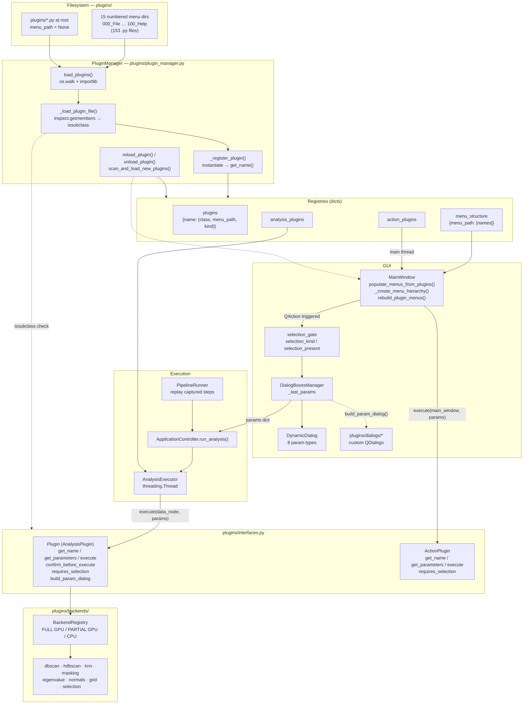
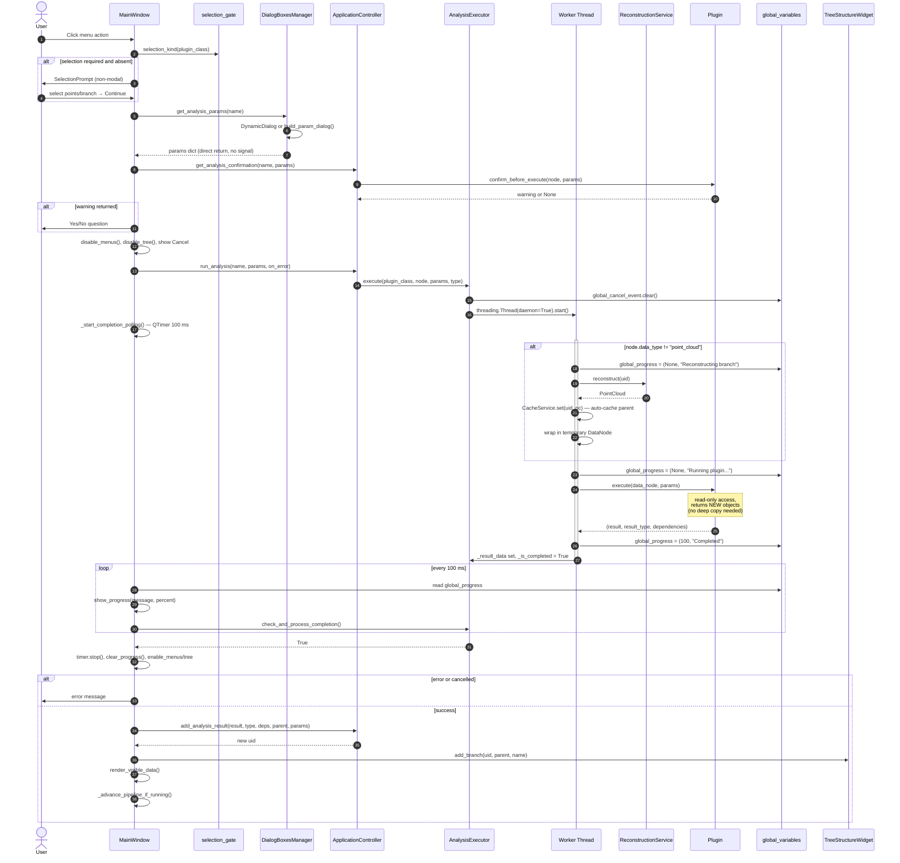
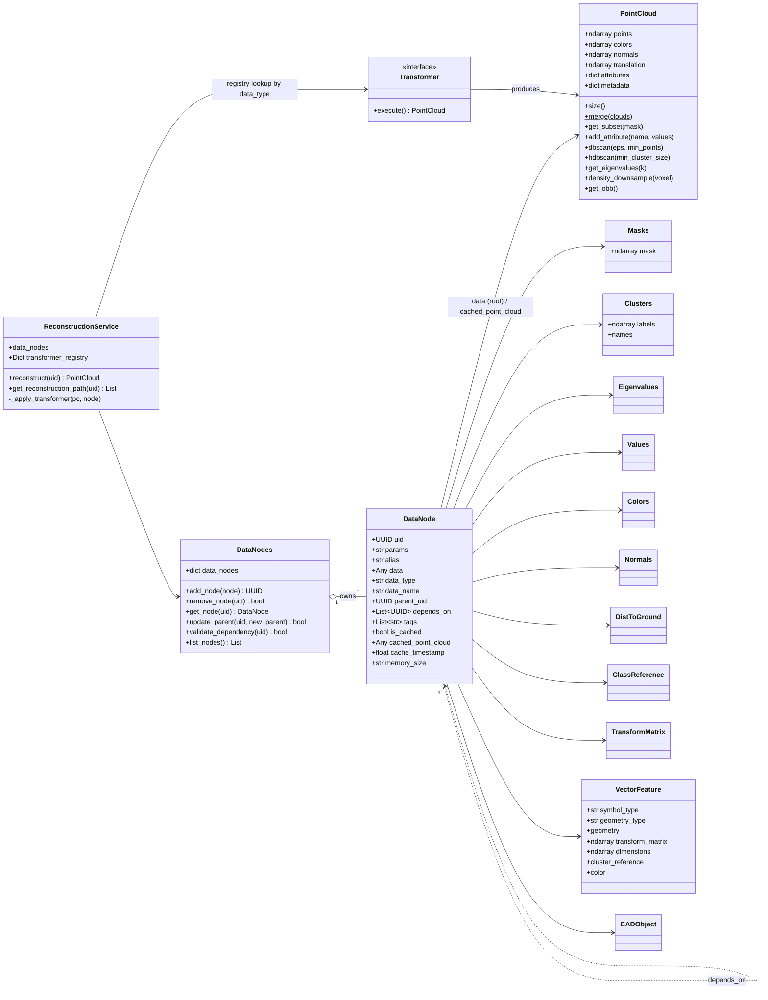
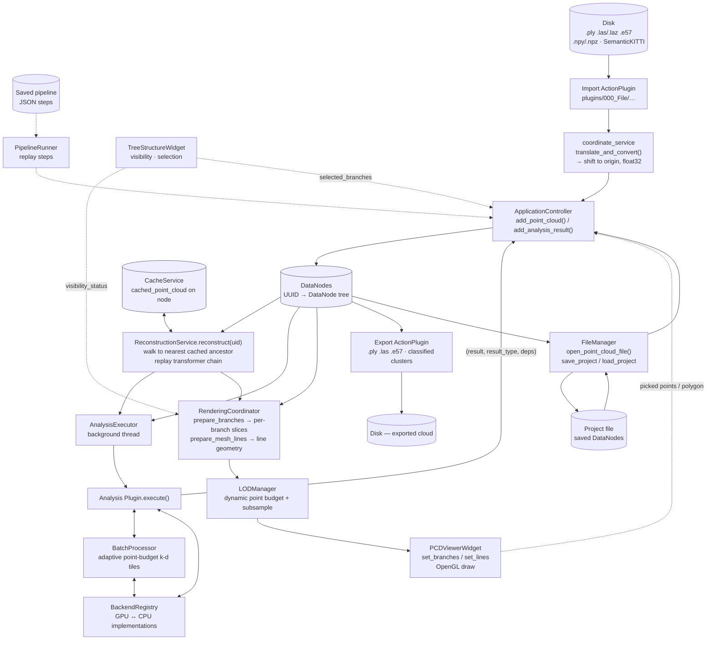

# SPCToolkit — Development Diagrams

Four diagrams generated from the current source tree (branch `refactor-linear-region-growing`).
They complement **ARCHITECTURE.md** (layers, flows) and **PLUGIN_ARCHITECTURE.md** (plugin reference).

1. [Component Diagram — Plugin System](#1-component-diagram--plugin-system)
2. [Sequence Diagram — Analysis Plugin Execution & Threading](#2-sequence-diagram--analysis-plugin-execution--threading)
3. [Class Diagram — DataNode / PointCloud Entities](#3-class-diagram--datanode--pointcloud-entities)
4. [Data Flow Diagram — Import → Reconstruct → Plugin → Render](#4-data-flow-diagram--import--reconstruct--plugin--render)

---

## 1. Component Diagram — Plugin System

Static structure of the plugin subsystem: discovery from the filesystem, the two
interfaces, the four registries, menu building, and how a running plugin reaches
data and hardware backends.

**Key facts**

| Item | Value |
|------|-------|
| Discovery | `os.walk` over `plugins/`, folder path → menu path, `000_` prefixes order menus |
| Plugin kinds | `Plugin` (background thread, returns `(result, type, deps)`) and `ActionPlugin` (main thread, returns `None`) |
| Registries | `plugins`, `menu_structure`, `analysis_plugins`, `action_plugins` |
| Hot reload | `ManagePluginsPlugin` → `reload/unload/scan` → `rebuild_plugin_menus()` |
| Backend choice | `global_variables.global_backend_registry`, picked once at startup from detected hardware |

---

## 2. Sequence Diagram — Analysis Plugin Execution & Threading

One full run of an analysis plugin, including the selection gate, the pre-flight
confirmation, the worker thread, and the 100 ms QTimer poll that brings the
result back to the main thread.

**Threading contract**

- `threading.Thread` (daemon), **never** `QThread`; one analysis at a time (`_is_running` guard).
- Cross-thread state: `global_variables.global_progress` (write in thread, read in timer) and
  `global_variables.global_cancel_event` (set by Cancel button, polled in thread).
- Cancellation is checked before reconstruction, before `execute()`, and after `execute()`.
- Menus and tree are disabled during the run; the viewer stays live for camera moves.

---

## 3. Class Diagram — DataNode / PointCloud Entities

The data model: one `DataNodes` collection of `DataNode` wrappers, each holding
either a full `PointCloud` or a lightweight derived payload that a matching
transformer replays onto a parent cloud.

**`transformer_registry` — `data_type` → transformer** (`core/services/reconstruction_service.py`)

| data_type | Transformer | Effect on the parent PointCloud |
|-----------|-------------|---------------------------------|
| `masks` | `MasksTransformer` | keep points where mask is True |
| `cluster_labels` | `ClustersTransformer` | apply cluster / class colors |
| `values` | `ValuesTransformer` | color by scalar field |
| `eigenvalues` | `EigenvaluesTransformer` | color by eigen-feature |
| `colors` | `ColorsTransformer` | replace RGB |
| `dist_to_ground` | `DistToGroundTransformer` | color by height above ground |
| `class_reference` | `ClassReferenceTransformer` | filter/color by class |
| `normals` | `NormalsTransformer` | attach normals |
| `transform_matrix` | `TransformMatrixTransformer` | apply 4×4 transform |

`ContainerTransformer` exists as a pass-through for organizational nodes and is not in the registry.
`VectorFeature` and `CADObject` are render-only payloads — they are drawn as wireframe branches, not reconstructed into clouds.

---

## 4. Data Flow Diagram — Import → Reconstruct → Plugin → Render

Where data enters, what stores it, what transforms it, and what leaves. Solid
arrows are point data; dashed arrows are control/metadata.

**Notes**

- Import plugins shift every cloud to the origin and cast to **float32** — the project has no
  large-coordinate code paths downstream.
- Derived nodes (masks, labels, values…) store only the small payload; the full cloud is
  rebuilt on demand by `ReconstructionService` and then cached on the node.
- Reconstruction always starts from the nearest **cached ancestor**, not from the root, so a
  deep branch chain does not re-run every transformer.
- The viewer never receives raw branch data — `RenderingCoordinator` turns each visible branch
  into its own `Nx6 float32` slice (it deliberately does **not** concatenate; the viewer does that
  lazily only when picking or zoom needs a global index), and `LODManager` subsamples to a
  budget derived from free RAM and VRAM first.

---

*Generated 2026-08-23 from the source tree; regenerate if the plugin or entity layout changes.*
*Companion references: **ARCHITECTURE.md** (layers, flows) and **PLUGIN_ARCHITECTURE.md** (plugin reference).*
