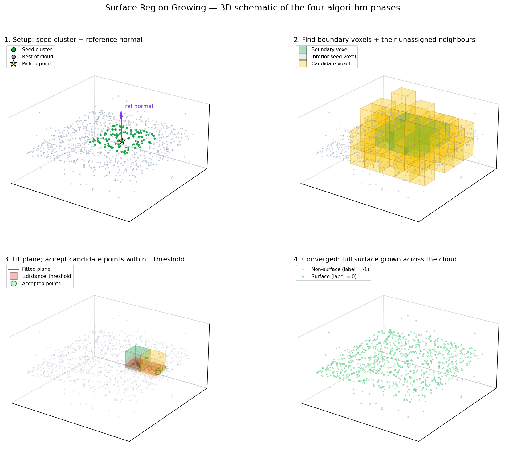
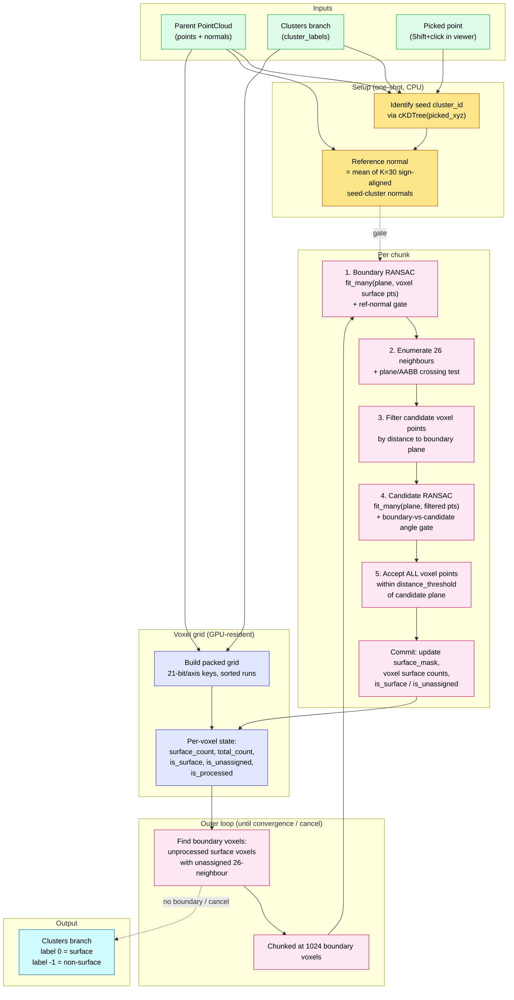

# Surface Region Growing

A picked point on a planar cluster (wall, floor, kerb top, slab) becomes a seed; the plugin grows that surface across the rest of the parent cloud by repeatedly fitting planes inside boundary voxels and accepting compatible neighbours. Plane fitting is delegated to the shared RANSAC infrastructure (`core/services/ransac`, `fit_many`); everything else in this file is orchestration on top of it.

Implemented in `030_surface_region_growing_plugin.py`. Requires CUDA — the voxel grid and expansion loop are GPU-resident.

*Figure regenerated by `_make_algorithm_figure.py`. 2D analog of the 3D algorithm — one curved surface line plus clutter, on a uniform voxel grid.*

---

## Architecture

### Layer responsibilities

| Layer                | Owns                                                                              | Does not own                          |
|----------------------|-----------------------------------------------------------------------------------|---------------------------------------|
| **Plugin (Action)**  | UI, parameter dialog, branch lookup, picked-point validation, thread management   | The algorithm, RANSAC                 |
| **Setup**            | Seed cluster identification, reference normal derivation                          | Iteration, growing                    |
| **Voxel grid**       | Packed-key build, per-voxel state arrays, neighbour lookup                        | Plane fitting, point acceptance       |
| **Outer loop**       | Boundary detection, chunking, convergence / cancel checks                         | What happens inside a chunk           |
| **Per-chunk steps**  | Boundary RANSAC, neighbour gating, candidate RANSAC, point acceptance, commit     | The RANSAC math itself                |
| **RANSAC**           | Plane minimal-fit, MSAC scoring, refit on inliers                                 | Anything outside the plane fit        |

---

## Inputs and output

**Inputs (from the application):**
- A `Clusters` branch (`cluster_labels` attribute) — typically a DBSCAN result on the parent cloud.
- The parent `PointCloud` of that branch, which **must carry per-point normals**, either embedded at import (PLY `nx/ny/nz`) or produced by the `normal_estimation` plugin.
- Exactly one point picked via Shift+click in the viewer, belonging to the desired seed cluster (label ≠ -1).

**Output:**
- A new `Clusters` branch whose `cluster_labels` is the same length as the parent cloud, with two labels:
  - `0` — grown surface
  - `-1` — non-surface

The output branch is recorded with parent = the same parent as the input Clusters branch, dependencies = `[parent_uid]`, plugin name = `surface_region_growing`, and the parameter dict.

---

## Algorithm

### 1. Seed identification and reference normal

The picked point's parent-cloud index is found by `cKDTree(clusters_pc.points).query(picked_xyz)`. The cluster id at that index is the seed cluster.

The reference normal is the **mean of `_REF_NORMAL_K = 30` sign-aligned, unit-length normals** drawn from the seed cluster:

1. Query the KDTree for `K × 5 = 150` nearest neighbours of the picked point, intersect with the seed cluster, and keep up to 30.
2. Take their normals, drop any with zero magnitude, unit-normalise the rest.
3. Sign-align against the picked point's own normal (the *anchor*): flip any whose dot product with the anchor is negative. Plane normals have a sign ambiguity, and averaging without alignment can cancel out.
4. Mean the aligned unit normals and unit-normalise the mean. Fall back to the anchor if the mean degenerates.

This reference normal is used as the orientation prior for the boundary-voxel RANSAC plane (optional, gated by `use_ref_normal_gate`).

### 2. Voxel grid build (CPU, then uploaded to GPU once)

Points are bucketed by `floor(p / voxel_size)`. Per-axis keys are shifted by `vk_min` to make them non-negative, then **packed into a single int64 with 21 bits per axis** (`x << 42 | y << 21 | z`). Maximum span per axis: `2^21 - 1 ≈ 2.1 M voxels`, with one bit of headroom reserved so `±1` neighbour offsets always stay in range. Span overflow raises a `RuntimeError` with a "increase voxel_size or reduce extent" hint.

The packed keys are sorted stably; runs of identical keys define voxels. From this single sort we materialise:

- `unique_packed` — `(V,)` sorted packed keys.
- `voxel_point_starts` — `(V+1,)` offsets into the sorted-point-index array.
- `voxel_point_indices` — `(N,)` per-voxel point ids (the `argsort` output).
- `voxel_total_counts` — `(V,)` `diff(voxel_point_starts)`.
- `point_voxel_idx` — `(N,)` voxel index for each point, via `searchsorted(unique_packed, packed_all)`.
- `unique_voxel_keys_shifted` — `(V, 3)` shifted integer keys per voxel, used for neighbour-offset arithmetic.

Three per-voxel mutable state arrays are derived from `cluster_labels == seed_cluster_id`:

- `is_surface_voxel` — at least one surface point in the voxel.
- `is_unassigned_voxel` — at least one *non*-surface point.
- `is_processed_voxel` — has already served as a boundary voxel (initialised all-False).

Everything is then uploaded to the GPU once. The outer loop never goes back to host memory until it converges.

### 3. Outer loop

Each iteration:

1. **Find boundary voxels**: surface voxels that haven't been processed yet *and* have at least one unassigned neighbour in the 26-neighbourhood (`_resolve_neighbors`).
2. **Process in chunks of 1024** (`_BOUNDARY_CHUNK`). Each chunk runs `_process_chunk_gpu`, returning the number of newly-added surface points.
3. **Mark this chunk's boundary voxels processed** after the chunk returns. They will never be revisited even if they are still surface voxels on a later iteration — a voxel gets one chance to grow outward, and the *new* surface voxels that result are what carries the front forward.
4. **Cancel check** at every loop boundary and every chunk boundary. On cancel, the partial `surface_mask_t` is preserved and `stopped_early = True` is returned.
5. **Terminate** when no boundary voxels exist (front exhausted) or when a full iteration adds zero new points (geometrically converged).

### 4. Per-chunk processing (Steps 1–5)

Implemented in `_process_chunk_gpu`. The five steps map to the labels in the diagram above.

**Step 1 — Boundary RANSAC.** For each boundary voxel, gather the surface points inside it (`_gather_points_compacted` with `take_surface=True`), strip padding to a list of `(N_b, 3)` numpy arrays via `_padded_to_lists`, and call `fit_many(..., model_type="plane", ...)`. The returned best plane per row is decomposed into a unit normal and offset `d` (`n·x + d = 0`). Rows are then masked off if (a) the voxel has fewer than `min_voxel_surface_points` surface points, or (b) `use_ref_normal_gate` is on and `|n · ref_normal| < cos(max_normal_angle_deg)`. Surviving rows hold the boundary plane for that voxel.

**Step 2 — Neighbour enumeration and plane / AABB test.** For each boundary voxel, expand to its 26 neighbours via integer offsets (`_resolve_neighbors`). Drop neighbours that don't exist in the grid or are already processed. Then test whether the boundary plane actually crosses the neighbour voxel using the exact plane / AABB test:

> A plane `n·x + d = 0` crosses an axis-aligned cube of half-width `h` centred at `c` iff `|n·c + d| ≤ h · (|nx| + |ny| + |nz|)`.

The right-hand side is the cube's "projected half-width" onto the plane normal. Cheaper than checking 8 corners individually, and exact for axis-aligned voxels.

**Step 3 — Candidate point filter.** For each surviving (boundary, candidate) pair, gather *all* points in the candidate voxel (`_gather_all_points_in_voxels`) and keep only those within `distance_threshold` of the boundary plane. These become the input to the candidate RANSAC. Cap at `_CANDIDATE_RANSAC_POINTS_CAP = 256` per voxel (the cap applies only to the RANSAC input; the final acceptance still uses all voxel points).

**Step 4 — Candidate RANSAC + angle gate.** Same shape as Step 1: pack into a numpy list, call `fit_many`, decompose into `(normal, d)` tensors. Then require `|n_candidate · n_boundary| ≥ cos(max_normal_angle_deg)`. Rows that fail are dropped.

**Step 5 — Accept points.** For each surviving candidate voxel, mark all its points (the full voxel, not the filtered RANSAC input) within `distance_threshold` of the *candidate* plane as new surface points. Pile them into `accepted_chunks` for the commit at the end.

### 5. Commit

After all sub-batches in the chunk finish, the union of accepted indices is computed (`torch.unique`), filtered to points that aren't already surface points, and the GPU state is updated:

- `surface_mask_t[newly] = True`
- `voxel_surface_counts_t.scatter_add_(...)` for the affected voxels.
- `is_surface_voxel_t` flips True for newly-touched voxels.
- `is_unassigned_voxel_t` updates per voxel: still unassigned iff `surface_count < total_count`.

These updates feed back into the next outer-loop iteration's boundary detection.

---

## Plane fitting via the shared RANSAC infrastructure

Both RANSAC stages call into `core/services/ransac.fit_many` with `model_type="plane"`. Two small bridge helpers handle the GPU↔list impedance:

- `_padded_to_lists(pts, counts)` slices a `(B, max_p, 3)` GPU tensor down to a list of `(N_b, 3)` numpy arrays.
- `_fit_planes_batched(pts_list, threshold, iterations, seed, device)` calls `fit_many`, filters out rows with fewer than `PlaneModel.min_samples` points, and packs the result back into `(B, 3)` normals, `(B,)` `d`, `(B,)` `valid` GPU tensors. `min_inlier_ratio` is set to `0.0` — the orchestrator applies its own gates afterward.

The cost is one CPU↔GPU roundtrip per RANSAC batch. In exchange the plugin gets:
- **MSAC truncated-quadratic scoring** instead of binary inlier counting.
- A **refit step on the inliers** (SVD on GPU) after the random-sample loop.
- A single canonical RANSAC implementation shared with cable tracing, pipe extraction, and any future plane-fitting consumer.

See `core/services/RANSAC.md` for the engine contract.

---

## Parameters

Exposed via `get_parameters()` and surfaced in the standard plugin dialog.

| Parameter                    | Default | Range       | Role                                                                              |
|------------------------------|---------|-------------|-----------------------------------------------------------------------------------|
| `voxel_size`                 | `0.5`   | `0.001–100` | Uniform voxel edge in world units. Should be ~ point spacing.                     |
| `distance_threshold`         | `0.05`  | `0.001–10`  | Final acceptance: a point joins the surface if within this of the candidate plane. |
| `ransac_iterations`          | `50`    | `10–500`    | `max_iterations` passed to `fit_many` for both stages.                            |
| `ransac_inlier_threshold`    | `0.05`  | `0.001–10`  | `threshold` passed to `fit_many` (distance for inlier classification).            |
| `min_voxel_surface_points`   | `5`     | `3–100`     | Minimum surface points required in a boundary voxel before attempting Step 1.     |
| `max_normal_angle_deg`       | `20`    | `0–90`      | Angle gate threshold (applied as `\|cos\| ≥ cos(angle)`). `90°` disables.         |
| `use_ref_normal_gate`        | `True`  | bool        | Whether to apply the reference-normal gate at Step 1.                             |

`distance_threshold` and `ransac_inlier_threshold` are deliberately separate: the inlier threshold drives which points the RANSAC scoring counts, while the distance threshold drives which voxel points end up in the output surface. They are often set to the same value but don't have to be.

---

## Memory and chunking

| Constant                          | Value | Purpose                                                                       |
|-----------------------------------|-------|-------------------------------------------------------------------------------|
| `_BOUNDARY_CHUNK`                 | 1024  | Boundary voxels processed per chunk.                                          |
| `_CANDIDATE_CHUNK`                | 1024  | (boundary, candidate) pairs processed per sub-batch within a chunk.           |
| `_CANDIDATE_RANSAC_POINTS_CAP`    | 256   | Max RANSAC input size per candidate voxel.                                    |
| `_REF_NORMAL_K`                   | 30    | Seed-cluster neighbours averaged for the reference normal.                    |

The chunking exists because the gathered-points tensor scales as `C × max_p × 3` and `fit_many`'s internal batched RANSAC adds another `C × max_p × 3` staging tensor on top. Without chunking, a dense seed cluster on a wide cloud can blow GPU memory in a single iteration.

---

## Threading and cancellation

The growing work runs on a daemon `threading.Thread`. The UI thread polls every 100 ms:

- `global_variables.global_progress` — `(percent, message)` tuple. The worker writes `(None, "Region growing — iter N, surface: X, +Y")` after every chunk; the main window renders it on the progress bar.
- `global_variables.global_cancel_event` — checked at the top of every outer iteration and before every chunk. On set, the worker breaks out, drops the GPU state, and returns the partial `surface_mask`.

Cancel always produces a result branch — even a partial growth saves what was found, so the user can keep iterating. The plugin shows a "Cancelled — partial result saved" dialog when this happens.

Menus and the tree are disabled for the duration; the viewer stays enabled so the user can keep manipulating the camera.

---

## Failure modes and termination

`_region_grow` exits cleanly in several distinct ways. All of them produce a valid `Clusters` branch.

| Termination               | Cause                                                                              | What the user sees                       |
|---------------------------|------------------------------------------------------------------------------------|------------------------------------------|
| **Convergent**            | Outer iteration completes with `newly_added_total == 0`.                           | Result branch, no dialog.                |
| **Front exhausted**       | No unprocessed surface voxels remain (every front voxel has been tried).           | Result branch, no dialog.                |
| **Cancelled**             | `global_cancel_event` set by the user.                                             | Result branch + "partial result" dialog. |
| **Hard error (CUDA off)** | `torch.cuda.is_available()` returns False at the top of `_region_grow`.            | Critical-error dialog, no branch added.  |
| **Hard error (span)**     | Voxel grid span exceeds 21-bit packing limit.                                      | Critical-error dialog, no branch added.  |

Hard errors propagate up through the worker's exception handler and are shown as `QMessageBox.critical`. No partial state is committed in those cases.

---

## Open questions and future work

- **Curve surfaces (cylinder, cone).** The current contract is plane-only; for a curved tank wall or cone roof, the candidate-voxel fit would need a different primitive. The RANSAC infrastructure already supports `cylinder` and `cone` (CPU-only). Wiring them in means generalising `_fit_planes_batched` to dispatch on `model_type` and propagating per-primitive state (`direction`, `radius`, `axis`, `half_angle`) instead of just `(normal, d)`. Worth doing once a concrete scenario demands it.
- **Adaptive voxel size.** A single `voxel_size` is awkward when point density varies across the cloud (TLS + mobile mix, near vs. far ranges). An adaptive scheme — voxel size scaled by local k-NN distance — would help, but adds bookkeeping to the packed-key build.
- **Multi-seed.** Currently exactly one picked point → one grown surface. Multi-pick (Shift+click several points on different surfaces, grow each in parallel) would only need the outer loop to track per-seed surface masks. The voxel grid and RANSAC infrastructure already support batching.
- **Seed-derived parameter calibration.** The user has to set `voxel_size` and `distance_threshold` by hand. Both could be estimated from the seed cluster: median nearest-neighbour distance → `voxel_size`, plane-fit residual on the seed cluster → `distance_threshold`. A "calibrate from seed" toggle in the dialog is a small addition.
- **Skip the CPU↔GPU roundtrip at the RANSAC boundary.** `fit_many` takes numpy lists. The plugin already has the points GPU-resident; the roundtrip is pure overhead. A future engine-internal entry point that accepts a packed GPU tensor + counts directly would close that gap. Defer until profiling shows the roundtrip dominates.
- **Promote to a generic region-grower.** Cable tracing (line), pipe extraction (cylinder), and surface growing (plane) share the same "voxel grid + boundary front + RANSAC" shape. A `core/services/region_grow` service with a `model_type` parameter would consolidate them. Premature until a second plane consumer appears.

---

## Design lineage

- **`DECISIONS.md` 2026-05-26** — RANSAC is a single-cloud contract; iteration is orchestration on top. This plugin is one of the orchestrators that decision predicted.
- **Commit `7a73d51`** — Replaced the inline `_batched_ransac` GPU kernel and the `_CANDIDATE_RANSAC_TRIES` retry workaround with `fit_many` calls. The angle gate moved from interleaved-with-iteration-selection to post-filter-on-best-plane. Reference: `core/services/RANSAC.md`.
